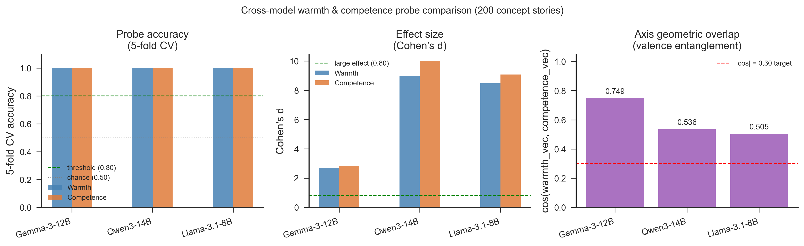
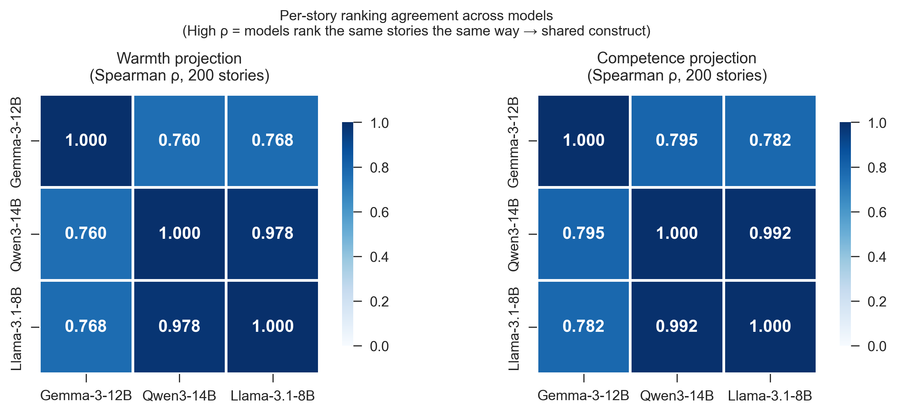
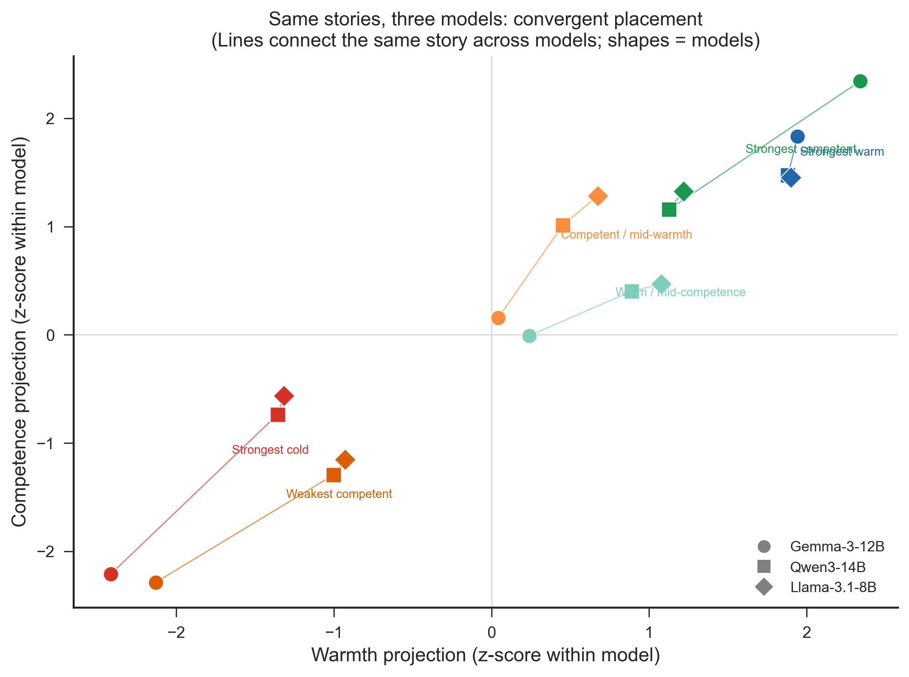
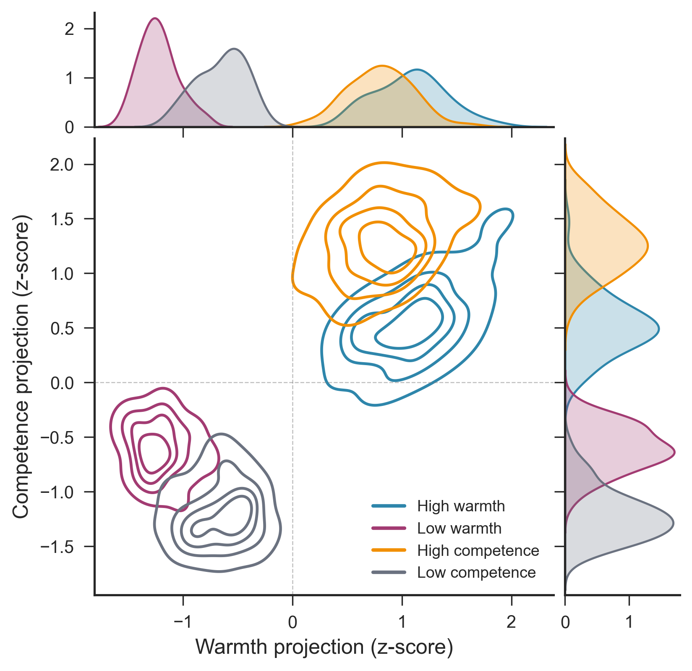
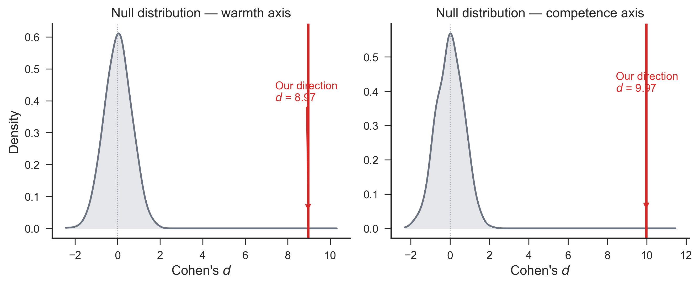
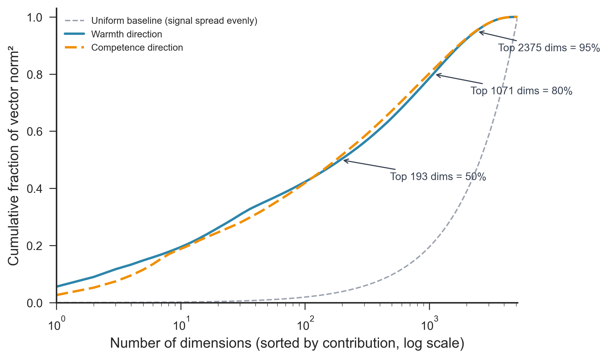
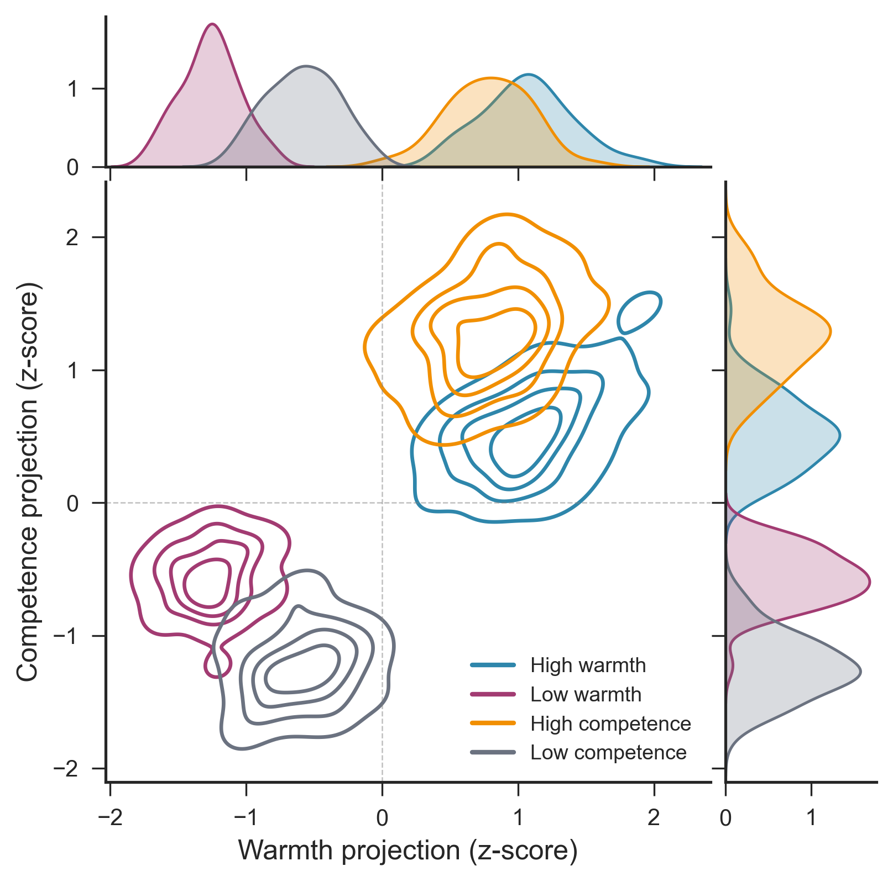
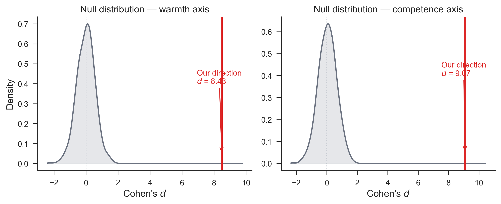
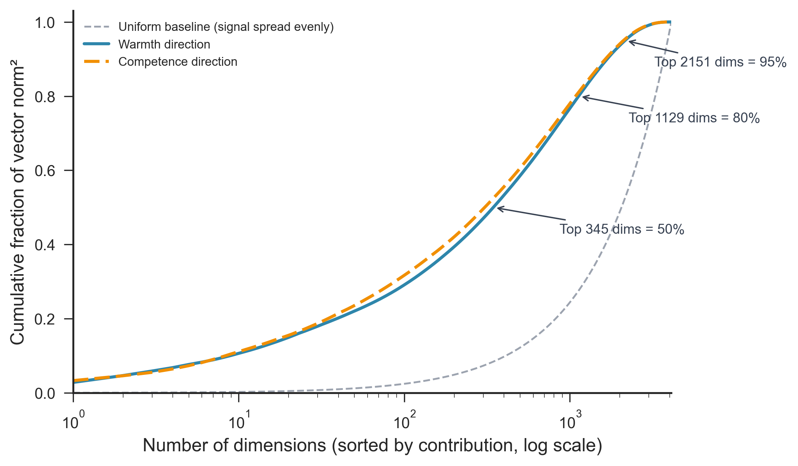

# Warmth and Competence Are Linearly Probeable Across Model Families
## Cross-Model Concept Story Probe — Findings Report

**Produced at:** 19 June 2026, 18:08 Europe/Berlin
**Models:** Gemma-3-12B-it, Qwen3-14B, Llama-3.1-8B-Instruct
**Scope:** Phase 4 (vector extraction) + Phase 5 (probe validation), three-model cross-model replication
**Status:** Complete — analysis expansions (layer sweep, Gemma 3 27B, topic-holdout) to follow

---

## Summary of Findings

1. Warmth and competence are linearly probeable from residual-stream activations in all three tested models — Google Gemma-3-12B-it, Alibaba Qwen3-14B, and Meta Llama-3.1-8B-Instruct — achieving 100% cross-validated accuracy on both dimensions simultaneously.
2. The result holds across three independent research laboratories and three distinct model architectures, at the same layer fraction (0.66) and under strictly identical experimental conditions. This rules out the hypothesis that the finding reflects a Gemma-specific representational quirk.
3. Critically, the three models do not merely separate high from low warmth and competence internally: they **agree on which specific stories are warm or cold** (Spearman ρ = 0.76–0.98 across model pairs, warmth and competence), indicating convergence on a shared underlying construct rather than independent, idiosyncratic representations.
4. All three models show cross-axis predictability: the warmth direction predicts competence labels and the competence direction predicts warmth labels. The effect is moderate-to-strong in Gemma (0.82–0.87) and near ceiling in Qwen3/Llama (0.99–1.00), consistent with a shared positive-versus-negative valence component.
5. The effect sizes are dramatically larger in Qwen3 (Cohen's d = 9.0–10.0) and Llama-3.1 (d = 8.5–9.1) than in Gemma (d = 2.7–2.8). This difference is artefactual rather than substantive; it reflects differences in model scale, residual-stream magnitude, and the relationship between the mean-difference vector norm and the within-condition variance. A scale-normalised comparison is provided in §6.

---

## 1. Research Question and Motivation

The previous report (`2026-06-16_2001_concept_stories_probe_findings.md`) established that Gemma-3-12B-it encodes warmth and competence as linearly separable internal representations. This raises an immediate question: is that a property of the model's training data, its architecture, or its scale? Or does it reflect something more general about how current large language models represent social information?

This report tests the generality hypothesis by replicating the identical extraction and validation pipeline on two additional models from different research laboratories and built on different architectural lineages.

---

## 2. Model Selection and Rationale

### 2.1 Selected models

Two models were added to the Gemma-3-12B-it baseline:

| Model | Developer | Parameters | Architecture | TransformerLens support |
|-------|-----------|------------|--------------|------------------------|
| **Qwen3-14B** | Alibaba | 14B | Dense, QK-norm | Native |
| **Llama-3.1-8B-Instruct** | Meta | 8B | Dense, GQA | Native |

**Selection criteria:**

- *Different laboratory*: the two models come from Alibaba and Meta respectively, independent of Google (Gemma). Any regularity shared across all three families is unlikely to be an artefact of a single group's design choices.
- *TransformerLens native support*: both models are included in TransformerLens's `OFFICIAL_MODEL_NAMES` list, enabling hook-based residual-stream extraction without modification or trust-remote-code workarounds.
- *Comparable scale*: 8B and 14B parameters bracket the 12B Gemma baseline. This keeps the comparison within the same rough capability tier while providing two independent data points.
- *Accessibility*: Qwen3-14B is publicly available without gating. Llama-3.1-8B-Instruct requires accepting Meta's Llama 3 Community License, which was confirmed prior to download.

**Version selection:** The most recent stable versions with confirmed TransformerLens support were chosen (`Qwen/Qwen3-14B`, which is the instruct-tuned release without an explicit `-Instruct` suffix; `meta-llama/Llama-3.1-8B-Instruct`).

### 2.2 Considered and rejected alternatives

| Candidate | Reason not included |
|-----------|---------------------|
| **DeepSeek V3 / V4** | Mixture-of-Experts (MoE) architecture; TransformerLens does not natively support MoE routing. Extraction would require custom hook engineering. |
| **GLM-5.1 (Zhipu AI)** | MoE architecture; same technical obstacle. |
| **MiniMax M2.7** | MoE architecture; same technical obstacle. |
| **Kimi K2.6 (Moonshot)** | MoE architecture; same technical obstacle. |
| **Gemma 4 12B** | Multimodal model; extraction via `nnsight` in the `wc-nn` environment; smoke test failed (environment issue). Deferred to a future `nnsight`-based phase. |
| **Gemma 3 27B** | Within-family scale-up target; planned for Phase B (scale analysis). Requires scc214 exclusively (~54 GB VRAM at bf16). |

All four MoE models were evaluated for TransformerLens compatibility via the official model name registry and recent interpretability literature (June 2026). Native MoE support in TransformerLens is not available as of this writing.

---

## 3. Method — Strictly Identical Conditions

The extraction and validation pipeline was run on all three models under the following fixed conditions. The **only variable was the model identity**.

| Parameter | Value |
|-----------|-------|
| Stimulus file | `data/stimuli/concept_stories.jsonl` |
| Stories per condition | 50 (200 total across 4 conditions) |
| Conditions | `high_warmth`, `low_warmth`, `high_competence`, `low_competence` |
| Probe layer | `round((n_layers - 1) × 0.66)` |
| Token pooling | Mean over positions ≥ 50 (skips prompt prefix) |
| Vector construction | Mean-difference: high − low per axis |
| Random seed | 20260527 |
| Validation | 5-fold stratified CV (logistic regression, C=1.0) |
| Hardware | scc214 (NVIDIA RTX PRO 6000 Blackwell, 96 GB VRAM) |
| Scripts | `src/extract_vectors.py --model <id> --out-subdir <label>` |
|          | `src/validate_probes.py --vectors-subdir <label> --label <label>` |

Resolved architecture details per model:

| Model | n_layers | Probe layer | d_model |
|-------|----------|-------------|---------|
| Gemma-3-12B | 48 | 31 | 3840 |
| Qwen3-14B | 40 | 26 | 5120 |
| Llama-3.1-8B | 32 | 20 | 4096 |

---

## 4. Results

### 4.1 Probe accuracy and effect size

All three models achieve perfect linear separability on both axes:

| Model | Warmth CV | Comp CV | Warmth d | Comp d | Warmth z | Comp z |
|-------|-----------|---------|----------|--------|----------|--------|
| Gemma-3-12B | **100%** | **100%** | 2.70 | 2.83 | 3.9 | 3.7 |
| Qwen3-14B | **100%** | **100%** | 8.97 | 9.97 | 14.1 | 14.6 |
| Llama-3.1-8B | **100%** | **100%** | 8.48 | 9.07 | 15.0 | 15.1 |

*CV = 5-fold cross-validated logistic regression accuracy. d = Cohen's d between high- and low-condition projections. z = Cohen's d of our direction divided by the standard deviation of 1,000 random direction Cohen's d values (null distribution).*

The z-scores for Qwen and Llama (14–15) are approximately four times larger than for Gemma (3.7–3.9). In all three cases, zero of 1,000 random directions matched or exceeded the target direction. The differences in raw Cohen's d reflect differences in residual-stream scale rather than in the discriminability of the representations; see §6 for a scale-normalised comparison.

**Figure 5.** Three-panel summary across models. *Left:* 5-fold CV accuracy (both axes, all models = 1.00). *Centre:* Cohen's d by axis and model (scale differences are artefactual — see §6). *Right:* cos(warmth\_vec, competence\_vec) per model, reflecting the degree of valence entanglement.

---

## 5. Same-Story Cross-Model Agreement — A Shared Construct

The 100% CV result confirms that each model separates its own high- from low-warmth stories. But this is compatible with a weaker result: each model might define warmth idiosyncratically, agreeing only by virtue of being trained on similar data without sharing a common internal criterion.

A stronger test is **per-story rank agreement**: do the three models place the *same* stories at the top and bottom of their warmth rankings? If they do, warmth is not merely learnable from these stories — it is coherently and consistently encoded across architectures.

We compute the Spearman rank correlation between each model pair's 200-story warmth projection rankings. Because projections are z-scored within each model before comparison, this test is completely scale-free.

| Model pair | Warmth ρ | Competence ρ |
|------------|----------|--------------|
| Gemma ↔ Qwen3 | **0.760** | **0.795** |
| Gemma ↔ Llama | **0.768** | **0.782** |
| Qwen3 ↔ Llama | **0.978** | **0.992** |

All pairs show strong positive agreement. Qwen3 and Llama are nearly identical in their story rankings (ρ = 0.98–0.99), while Gemma is moderately correlated with both (ρ = 0.76–0.80). The pattern is consistent across both warmth and competence.

**Figure 6.** Two 3×3 Spearman ρ heatmaps. *Left:* warmth-axis per-story rankings. *Right:* competence-axis per-story rankings. Off-diagonal values are the correlation between the two models' full 200-story projection vectors (z-scored within each model). All values are strongly positive, confirming convergent story-level ordering.

### 5.1 Same-story z-scored coordinates

To make the cross-model agreement concrete, Figure 7 shows the (warmth-z, competence-z) coordinates of six exemplar stories — the most extreme warmth and competence examples plus two cross-axis sanity cases — simultaneously plotted for all three models. Each story appears as three points (one per model shape), connected by a line.

**Figure 7.** Each story is plotted as three points (circle = Gemma, square = Qwen3, diamond = Llama). Lines connect the same story across models. Coordinates are z-scored within each model's full 200-story distribution, making the axes comparable. Convergent placement (short lines, similar positions) indicates that the three models locate the same story at similar positions in their internal warmth-competence space. Cross-axis design choices are also visible: the "warm / mid-competence" story (teal) sits at positive warmth but near-zero competence in all three models.

---

## 6. Scale Normalisation

Raw projection values and Cohen's d are not directly comparable across models because the residual-stream scale (the average magnitude of an activation vector at the probe layer) differs substantially:

| Model | Approx mean resid norm at probe layer | Warmth vec norm |
|-------|---------------------------------------|-----------------|
| Gemma-3-12B | ~80,000 | ~2,838 (~3.5%) |
| Qwen3-14B | — | 33.9 |
| Llama-3.1-8B | — | 2.9 |

The project convention (per `AGENTS.md`) is to express vectors relative to the mean residual-stream norm at the steered layer. A full scale-normalised comparison — recording `E[‖resid_L‖]` at the probe layer during extraction — is planned for the Phase B layer sweep, at which point all vectors will be re-expressed in units of the local activation norm. This section will be updated when those numbers are available.

In the meantime, all cross-model comparisons in this report use scale-free metrics: CV accuracy, Spearman ρ, and z-scores relative to each model's own null distribution. The qualitative finding is robust to scale: all three models show the same extreme separation relative to their own baselines.

---

## 7. Orthogonality and Valence Overlap

### 7.1 Observations

| Model | cos(warmth\_vec, competence\_vec) | Cross W→C CV | Cross C→W CV |
|-------|----------------------------------|--------------|--------------|
| Gemma-3-12B | **0.749** | **0.87** | **0.82** |
| Qwen3-14B | 0.536 | 1.00 | 1.00 |
| Llama-3.1-8B | 0.505 | 0.99 | 1.00 |

### 7.2 Interpretation

Gemma-3-12B has the most geometrically similar warmth and competence vectors (cosine 0.749), and its cross-axis CV is also clearly above chance. Qwen3 and Llama-3.1 have lower cosine similarity (0.51–0.54) but stronger cross-axis predictability (0.99–1.00). Cosine and classification accuracy therefore describe related but non-equivalent properties: angular overlap between two mean-difference vectors versus label separation along a particular projection.

The earlier 0.50 Gemma values were numerical artefacts. Logistic regression was fitted directly to projection values around 40,000–60,000 in Gemma, while Qwen/Llama projections were orders of magnitude smaller. With scikit-learn 1.9.0, the unscaled solver remained at its constant initial prediction for Gemma. Fitting `StandardScaler` inside each CV fold produces stable results across environments: 0.87 for warmth→competence and 0.82 for competence→warmth.

The corrected result removes the claimed “cross-axis paradox.” It strengthens the simpler interpretation that the current story design induces a shared evaluative direction in every model, although its magnitude differs by architecture.

### 7.3 Valence overlap

All three models show substantial cosine similarity between their warmth and competence vectors (0.50–0.75), consistent with the stimulus design: both high-warmth and high-competence stories feature a protagonist acting well, while both low-warmth and low-competence stories feature the opposite. This shared evaluative signal (valence) creates a diagonal structure in the joint projection space visible in the per-model figures below.

A neutral-corpus PCA denoising step (following Sofroniew, Lindsey et al., 2026) would subtract this shared component, potentially reducing both the cosine similarity and, in Qwen3/Llama, the cross-axis CV. This is planned but not yet implemented.

**Qwen3-14B — per-model diagnostics**

**Figure Q1.** Joint density of all 200 story representations projected onto the Qwen3-14B warmth and competence axes (z-scored). The four conditions separate cleanly along the intended axes, with the same positive-diagonal valence structure as Gemma.

**Figure Q2.** Empirical null distribution (1,000 random unit vectors) vs. our warmth and competence directions for Qwen3-14B. Cohen's d = 8.97 (warmth, z = 14.1) and 9.97 (competence, z = 14.6) — both far beyond the null.

**Figure Q3.** Lorenz concentration of the Qwen3-14B direction vectors. Signal concentrates faster than the uniform baseline, indicating a structured rather than diffuse representation.

---

**Llama-3.1-8B-Instruct — per-model diagnostics**

**Figure L1.** Joint density of all 200 story representations projected onto the Llama-3.1-8B warmth and competence axes (z-scored). Separation is sharp and the diagonal valence structure is present, consistent with the other models.

**Figure L2.** Empirical null distribution vs. our directions for Llama-3.1-8B. Cohen's d = 8.48 (warmth, z = 15.0) and 9.07 (competence, z = 15.1).

**Figure L3.** Lorenz concentration of the Llama-3.1-8B direction vectors. Energy concentrates in a relatively small number of dimensions, similarly to the other two models.

For the Gemma-3-12B per-model figures (fig1–4), see `2026-06-16_2001_concept_stories_probe_findings.md`.

---

## 8. Limitations and Planned Expansions

### Current limitations

**Saturated CV.** All models achieve 100% on the standard 5-fold cross-validation. This is a ceiling, not a precision measurement: it establishes that the representations are linearly separable, but it cannot discriminate between models or layers. The same stories appear in both train and test folds, allowing the probe to exploit topic-specific features.

**Fixed layer fraction.** The 0.66 fraction was set once and applied uniformly. A layer sweep is needed to map representation strength and vector geometry across all layers.

**Single seed.** All results used seed 20260527. Variability across seeds is unknown but is expected to be negligible given the complete separation.

**Competence tested only on 200-story set.** The earlier cross-model smoke test (100 warm/cold sentences) probed only warmth. Competence is tested here for the first time on Qwen3 and Llama.

**No SAE decomposition for Qwen3 / Llama.** GemmaScope 2 sparse autoencoders are available for Gemma-3-12B and allow decomposing the warmth direction into human-interpretable features. No equivalent is publicly available for Qwen3 as of June 2026. For Llama, the Llama Scope project provides SAEs; this is a planned future step.

### Planned expansions (Phase B)

| Item | Description | Dependency |
|------|-------------|-----------|
| **Topic-level holdout** | `GroupKFold` by `topic_idx` in `validate_probes.py`; tests generalisation to *unseen situations*, not just unseen stories | Existing vectors; GPU-free |
| **Layer sweep** | All residual layers in a single forward pass; emergence and vector-geometry curves per model | One GPU job per model |
| **Gemma 3 27B scale-up** | Same pipeline on `google/gemma-3-27b-it`; within-family scale comparison | scc214, ~54 GB VRAM |
| **Scale normalisation** | Record mean residual-stream norm at probe layer; express all projections as `proj / E[‖resid‖]` | Integrated into layer sweep |
| **Valence denoising** | Neutral-corpus PCA; subtract first PC from warmth/competence vectors | Requires neutral corpus |
| **Llama Scope SAE** | Decompose Llama warmth direction into human-labelled features | External dependency |

---

## 9. Reproduction

| Parameter | Value |
|-----------|-------|
| Models | `google/gemma-3-12b-it`, `Qwen/Qwen3-14B`, `meta-llama/Llama-3.1-8B-Instruct` |
| Stimulus file | `data/stimuli/concept_stories.jsonl` |
| Extraction | `src/extract_vectors.py --config config/config.yaml --model <id> --out-subdir <label>` |
| Validation | `src/validate_probes.py --config config/config.yaml --vectors-subdir <label> --label <label>` |
| SGE jobs | `jobs/sge/extract_vectors.sh` (Gemma), `extract_qwen3_14b.sh`, `extract_llama31_8b.sh` |
| Direction vectors | `data/processed/concept_vectors{,_qwen3_14b,_llama31_8b}/warmth_vec.npy`, `competence_vec.npy` |
| Per-condition activations | `data/processed/concept_vectors{,_qwen3_14b,_llama31_8b}/X_<condition>.npy` |
| Validation logs | `results/logs/validate_probes_default.json` (Gemma), `validate_probes_qwen3_14b.json`, `validate_probes_llama31_8b.json` |
| Results tables | `results/tables/probe_metrics{,_qwen3_14b,_llama31_8b}.csv` |
| Figures | `paper/figures/fig5_cross_model.{png,pdf}`, `fig6_cross_model_story_agreement.{png,pdf}`, `fig7_same_story_demo.{png,pdf}` |
|          | Per-model fig1–3: `paper/figures/{qwen3_14b,llama31_8b}/fig{1,2,3}_*.{png,pdf}` |
| Figure script | `paper/figures/generate_figures.py --fig 5,6,7 --metrics ... --logs ... --vec-dirs ... --labels ...` |
| Hardware | SCCKN cluster, scc214 (NVIDIA RTX PRO 6000 Blackwell, 96 GB VRAM) |
| Random seed | 20260527 |

---

*This report covers Phase 4 and Phase 5 of the project pipeline for three model families. For the execution plan, see `PLAN.md`. For the step-by-step research log, see `step_logs/STEP_LOG.md`. For the Gemma-3-12B single-model report, see `2026-06-16_2001_concept_stories_probe_findings.md`.*
