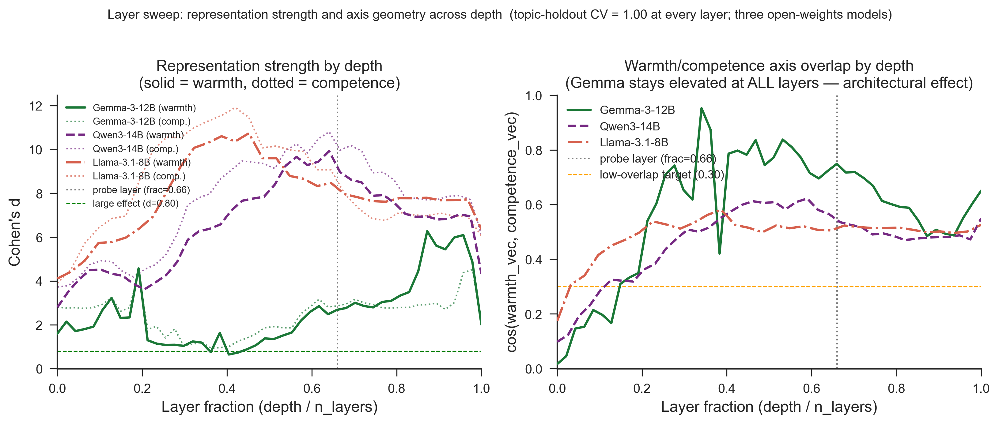

# Gemma-3 Scale Comparison: Corrected Geometry Findings

**Produced at:** 2026-06-20 13:03 Europe/Berlin
**Models:** `google/gemma-3-12b-it`, `google/gemma-3-27b-it`
**Phase:** B3 — within-family scale comparison

---

## Artifacts

- **Scripts:** `src/layer_sweep.py`, `src/validate_probes.py`
- **Inputs:** `data/processed/concept_vectors/`, `data/processed/concept_vectors_gemma3_27b/`
- **Outputs:** `results/tables/layer_sweep_gemma3_12b.csv`, `results/tables/layer_sweep_gemma3_27b.csv`; `results/logs/validate_probes_default.json`, `results/logs/validate_probes_gemma3_27b.json`
- **Figures:** `paper/figures/fig8_layer_emergence.{png,pdf}`

---

> Correction: the original version of this report described chance-level cross-axis
> CV in both Gemma models. That result was a numerical artefact from fitting
> unscaled logistic regression to large-offset residual-stream projections. The
> corrected scale-standardised values are reported below. The layer-sweep and
> vector-cosine findings are unchanged.

---

## Overview

This phase tested whether the depth-wise warmth/competence geometry observed in
Gemma-3-12B persists at 27B scale. The answer is yes:

- Both models achieve 1.00 full-feature and topic-holdout CV on both target axes.
- Gemma-27B has slightly stronger probe-layer effect sizes.
- Both models show elevated cos(W,C) through most of the network, with closely
  matched depth profiles.
- Both models show substantial cross-axis predictability after proper feature
  standardisation. The extracted axes are therefore not behaviourally independent.

The valid scale result is geometric: Gemma-3's high warmth/competence vector overlap
persists from 12B to 27B. The previously claimed “cross-axis paradox” is withdrawn.

---

## Method

The 27B run used the same 200 concept stories, seed (`20260527`), token pooling, and
probe-layer fraction (`0.66`) as the 12B baseline. TransformerLens loaded
`google/gemma-3-27b-it` with 62 layers and residual width 5,376; the probe layer was
L40.

The SCCKN job performed:

1. activation extraction and mean-difference vector construction;
2. probe validation;
3. an all-layer residual-stream sweep;
4. output synchronisation.

Cross-axis accuracy is now computed using a `StandardScaler` fitted inside each CV
training fold followed by logistic regression. This makes the 1-D metric invariant
to the large differences in residual-stream offset and scale across models.

---

## Probe-Layer Results

| Metric | Gemma-3-12B | Gemma-3-27B |
|---|---:|---:|
| Warmth full-feature CV | 1.00 | 1.00 |
| Competence full-feature CV | 1.00 | 1.00 |
| Warmth topic-holdout CV | 1.00 | 1.00 |
| Competence topic-holdout CV | 1.00 | 1.00 |
| Warmth Cohen's d | 2.70 | 2.95 |
| Competence Cohen's d | 2.83 | 3.27 |
| cos(W,C) | 0.749 | 0.708 |
| Cross W→C CV | 0.87 | 0.90 |
| Cross C→W CV | 0.82 | 0.86 |
| Mean residual norm | 79,756 | 61,576 |

The 27B model separates the intended contrasts slightly more strongly at the selected
layer. Cross-axis CV remains high in both models, which is consistent with the shared
positive-versus-negative framing of the stimulus set.

---

## Layer Sweep

**Figure 8.** *(Left)* Cohen's d across depth for warmth (solid) and competence
(dotted). *(Right)* cos(W,C) across depth. Gemma-3-12B and Gemma-3-27B show closely
matched, elevated cosine profiles through most layers; Qwen3 and Llama plateau lower.
The figure measures representation strength and vector geometry, not cross-axis CV.

### Depth-wise cosine

| Model | Probe-layer cos | Peak cos | Peak layer |
|---|---:|---:|---:|
| Gemma-3-12B | 0.749 | 0.952 | L16 |
| Gemma-3-27B | 0.708 | 0.933 | L23 |

The near-matching profiles support a within-family geometry result: increasing Gemma-3
from 12B to 27B does not remove the shared warmth/competence direction.

### Cohen's d emergence

Both Gemma models show moderate early separation, a mid-network dip, and a late rise.

| Region | Gemma-3-12B | Gemma-3-27B |
|---|---|---|
| Early peak (frac < 0.25) | d ≈ 3–4 | d ≈ 2.9–3.2 |
| Mid-network | multiple layers below d = 1.5 | several layers below d = 1.5 |
| Late warmth peak | d = 6.09 at L45 | d = 5.10 at L58 |
| Probe-layer W/C | 2.70 / 2.83 | 2.95 / 3.27 |

### Residual norm

The probe-layer mean residual norm is lower in 27B even though its final-layer norm is
higher. This confirms that steering strengths must be calibrated per model and per
layer relative to the local residual norm rather than transferred as absolute values.

---

## Corrected Four-Model Comparison

| Model | Warmth d | Competence d | cos(W,C) | Cross W→C | Cross C→W |
|---|---:|---:|---:|---:|---:|
| Gemma-3-12B | 2.70 | 2.83 | 0.749 | 0.87 | 0.82 |
| Gemma-3-27B | 2.95 | 3.27 | 0.708 | 0.90 | 0.86 |
| Qwen3-14B | 8.97 | 9.97 | 0.536 | 1.00 | 1.00 |
| Llama-3.1-8B | 8.48 | 9.07 | 0.505 | 0.99 | 1.00 |

All four models contain a shared cross-axis signal. Gemma has higher angular overlap
but somewhat weaker 1-D cross-axis classification than Qwen/Llama. This is a
quantitative architecture difference, not evidence of axis independence.

---

## Limitations and Next Steps

- The sweep records cos(W,C), not scale-standardised cross-axis CV at every layer.
- The stimuli deliberately contrast positive and negative behaviour, so valence is a
  plausible common cause of the cross-axis signal.
- Neutral-corpus PCA denoising remains the next direct test of whether a more
  axis-specific warmth/competence representation can be recovered.
- B4 should compare scale-normalised projection and steering quantities using each
  layer's `mean_resid_norm`.

Reproducible validation logs:

- `results/logs/validate_probes_default.json`
- `results/logs/validate_probes_gemma3_27b.json`
