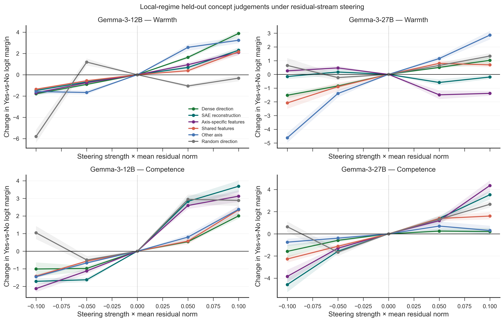
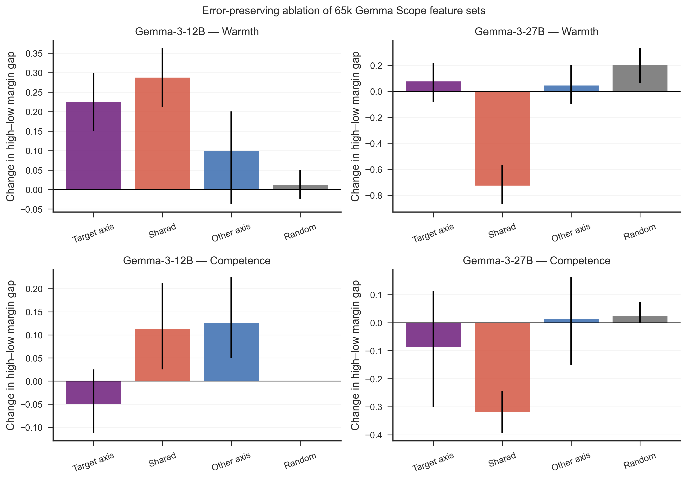

# Gemma Scope 2: Sparse Features, Cross-Scale Conservation, and Concept Causality

**Produced:** 2026-06-20 14:51 (Europe/Berlin)  
**Models:** Gemma-3-12B-it and Gemma-3-27B-it  
**Scope:** Warmth/competence feature decomposition and concept-level causal tests  
**Status:** Complete for direct concept judgements; hiring-callback causality remains future work

---

## Artifacts

- **Scripts:** `src/gemma_scope_analysis.py`, `src/gemma_scope_causality.py`, `src/match_gemma_scope_features.py`, `src/summarize_gemma_scope_results.py`
- **Inputs:** `data/processed/concept_vectors/`, `data/processed/concept_vectors_gemma3_27b/`, `data/processed/gemma_scope_gemma3_12b/`, `data/processed/gemma_scope_gemma3_27b/`
- **Outputs:** `results/tables/gemma_scope_metrics_gemma3_{12b,27b}.csv`, `results/tables/gemma_scope_causality_gemma3_{12b,27b}_local.csv`, `results/tables/gemma_scope_causality_raw_gemma3_{12b,27b}_local.csv`, `results/tables/gemma_scope_feature_matches_12b_27b.csv`, `results/tables/gemma_scope_feature_match_null_12b_27b.csv`, `results/tables/gemma_scope_local_steering_slopes.csv`; `results/logs/gemma_scope_causality_gemma3_{12b,27b}_local.json`
- **Figures:** `paper/figures/fig9_gemma_scope_decomposition.{png,pdf}`, `paper/figures/fig10_gemma_scope_steering.{png,pdf}`, `paper/figures/fig11_gemma_scope_ablation.{png,pdf}`, `paper/figures/fig12_gemma_scope_feature_matching.{png,pdf}`

---

## Executive summary

We used Google's Gemma Scope 2 sparse autoencoders (SAEs) as a second
interpretability protocol on top of the existing TransformerLens activation
pipeline.

The main findings are:

1. **Gemma Scope 2 reconstructs the stored residual activations very well.**
   Mean reconstruction cosine is 0.995–0.998 across both models and all three
   SAE widths.
2. **Warmth and competence remain recoverable in sparse feature space, but
   widening the SAE does not monotonically improve the probe.** Topic-holdout
   accuracy ranges from 0.69 to 0.94.
3. **The feature-level organization is conserved across scale.** Matched 12B
   and 27B features have mean story-profile correlations of 0.49–0.66,
   exceeding row-permutation nulls for all five tested vector types
   (permutation \(p \approx .002\), 500 permutations).
4. **The original dense warmth and competence directions are causally
   functional for direct concept judgements.** In a small intervention regime,
   all four model-by-axis combinations show a positive, approximately linear
   steering response (\(R^2=0.915\)–0.990).
5. **Sparse causal localization is only partial.** SAE-derived directions
   preserve the causal effect in three of four cases, but fail for 27B warmth.
   Other-axis directions also frequently change the target judgement, so the
   evidence does not support clean warmth/competence modularity.
6. **The clearest sparse necessity result is scale-specific.** In 27B,
   ablating the shared feature set reduces both the warmth and competence
   high–low judgement gaps. The same pattern does not appear in 12B.

The defensible conclusion is therefore not “we found the warmth neuron.”
Instead, the results support a distributed, partially shared feature system
whose activation profiles persist from 12B to 27B and whose dense aggregate
directions causally influence explicit concept judgements.

## What Gemma Scope adds beyond TransformerLens

TransformerLens and Gemma Scope answer different questions and are
complementary.

| Tool | What it provides | Role in this study |
|---|---|---|
| TransformerLens | Hooks into residual streams and other internal locations; records or changes high-dimensional activations | Extracted the original layer-31 and layer-40 activations and applied steering hooks |
| Gemma Scope 2 | Pretrained sparse dictionaries that encode an activation as a small set of learned features and decode it back | Decomposed the dense warmth/competence signal into shared and axis-specific sparse components |

TransformerLens gives access to the internal vector. Gemma Scope attempts to
express that vector in a learned feature vocabulary. The latter can make a
mechanism easier to inspect, but SAE features are not guaranteed to correspond
one-to-one with human concepts.

Google DeepMind released Gemma Scope 2 on December 19, 2025 for every Gemma 3
size from 270M through 27B, including instruction-tuned models. The release
contains SAEs and transcoders at every layer and uses Matryoshka-style training
to improve feature quality. Google recommends medium-sparsity 64k or 256k
residual SAEs for many downstream uses. Our SAELens checkpoint names expose
these power-of-two widths as `65k` and `262k`.

## Questions tested

We tested four progressively stronger claims:

1. **Reconstruction:** Can a Gemma Scope SAE faithfully reconstruct the
   residual activations used by the original probes?
2. **Sparse representation:** Do warmth and competence remain discriminable
   after conversion into sparse features?
3. **Cross-scale conservation:** Do 12B and 27B contain features that respond
   similarly to the same stories?
4. **Causality:** Do dense and sparse concept directions change held-out
   warmth/competence judgements, and are the sparse feature sets necessary for
   those judgements?

The fourth claim is concept-level causality, not hiring causality. No callback
decision is evaluated in this report.

## Data and method

### Models, layers, and stories

We reused the committed activations from the original probe pipeline:

| Model | Residual layer | Hidden width | Stories |
|---|---:|---:|---:|
| Gemma-3-12B-it | 31 / 48 | 3,840 | 200 |
| Gemma-3-27B-it | 40 / 62 | 5,376 | 200 |

The story set contains 50 examples in each condition: high warmth, low warmth,
high competence, and low competence. Each condition covers the same 50 topics.
The stored activation for a story is the mean post-layer residual activation
after token 50.

### SAE checkpoints

For each model we evaluated residual-stream SAEs with medium target sparsity at
three widths:

- 16k: compact baseline
- 65k: primary analysis and all causal feature interventions
- 262k: high-width robustness check

The checkpoints exactly match the original probe layers:

- `gemma-scope-2-12b-it-res`, layer 31
- `gemma-scope-2-27b-it-res`, layer 40

### Feature directions

For each width, a story activation was SAE-encoded. Warmth and competence
feature vectors were defined as differences between class means:

\[
v_W = \mathbb{E}[z \mid high\ warmth] -
      \mathbb{E}[z \mid low\ warmth]
\]

\[
v_C = \mathbb{E}[z \mid high\ competence] -
      \mathbb{E}[z \mid low\ competence]
\]

where \(z\) is the sparse SAE feature vector.

For features with the same effect sign on both axes, the smaller absolute
effect was assigned to a shared component. The exact remaining differences
formed warmth-specific and competence-specific components. Each sparse
direction was decoded through the SAE decoder to obtain a residual-space
steering vector.

### Validation

We measured:

- relative reconstruction error and reconstruction cosine;
- mean number of active features;
- five-fold feature-space classification accuracy;
- topic-holdout accuracy using unseen topics;
- Cohen's \(d\);
- sparse warmth/competence cosine;
- alignment between decoded SAE directions and the original dense directions.

### Cross-scale matching

Feature IDs are not comparable across independently trained SAEs. We therefore
matched features by behavior:

1. select the largest-effect nonzero 65k features for each vector type;
2. compute each feature's centered activation profile over the same 200
   stories;
3. use one-to-one Hungarian matching to maximize profile correlation;
4. repeat after randomly permuting the 27B story order 500 times.

This tests whether the observed 12B↔27B alignment exceeds the optimistic
matching score obtainable when story identity is destroyed.

### Held-out causal evaluation

The 50 topics were deterministically divided into 40 training topics and 10
test topics using seed `20260527`. Directions and feature sets were built only
from the training topics.

For each held-out story, the model answered:

> Is the protagonist high in warmth/competence? Answer only Yes or No.

The outcome was the next-token logit margin:

\[
\text{margin} = \text{logit(Yes)} - \text{logit(No)}
\]

Both answer strings are single tokens in the two Gemma tokenizers.

We tested:

- the original dense direction;
- the decoded full SAE direction;
- the decoded axis-specific component;
- the decoded shared component;
- the other concept axis;
- one random residual direction orthogonal to the target dense direction.

Steering strength was expressed relative to the mean residual norm. We first
ran the planned broad range \([-0.5,-0.25,0,0.25,0.5]\). Because this produced
large non-specific effects, we repeated the experiment in the local range
\([-0.1,-0.05,0,0.05,0.1]\). Reported steering slopes use the local run.

For necessity tests, we selected the smallest set of 65k features covering 50%
of each feature vector's squared norm. We then zeroed those features while
preserving the SAE reconstruction error:

\[
x' = x + decode(z_{\mathrm{ablated}}) - decode(z)
\]

This prevents a feature ablation from being confounded with replacing the
entire residual stream by an imperfect SAE reconstruction.

All uncertainty intervals use paired topic bootstrap resampling.

## Results

### 1. Reconstruction is excellent, but sparse concept quality is not monotonic in width

**Figure 9.** Gemma Scope 2 reconstructs the stored mean residual activations
with cosine above 0.995. Increasing width reduces the number of active features
but does not consistently improve topic-holdout concept accuracy or alignment
with the original dense direction.

| Model | Width | Recon. cosine | Active features | Topic CV W/C | Decoded alignment W/C |
|---|---:|---:|---:|---:|---:|
| 12B | 16k | 0.9973 | 8.56 | 0.94 / 0.78 | 0.727 / 0.725 |
| 12B | 65k | 0.9974 | 6.31 | 0.72 / 0.77 | 0.742 / 0.642 |
| 12B | 262k | 0.9975 | 5.59 | 0.70 / 0.69 | 0.749 / 0.715 |
| 27B | 16k | 0.9951 | 7.64 | 0.84 / 0.76 | 0.607 / 0.398 |
| 27B | 65k | 0.9951 | 6.89 | 0.77 / 0.75 | 0.584 / 0.570 |
| 27B | 262k | 0.9950 | 5.28 | 0.71 / 0.79 | 0.646 / 0.634 |

The key distinction is between reconstruction and interpretation. An SAE can
reconstruct almost the entire vector while distributing a particular
human-defined contrast across features in a way that is less linearly
separable than the original residual representation.

At 65k, sparse warmth/competence cosine is 0.411 in 12B and 0.373 in 27B,
substantially below the original dense cosine values of 0.749 and 0.708. The
SAE basis therefore makes the two contrasts geometrically less overlapping,
but lower cosine does not by itself establish causal independence.

### 2. Feature activation profiles are conserved from 12B to 27B

**Figure 12.** Boxplots show observed one-to-one feature-match correlations.
Orange diamonds show the corresponding matched mean after permuting the 27B
story order; error bars are the central 95% of 500 permutations.

| Feature vector | Matches | Observed mean | Null mean | Null 95% interval | Permutation p |
|---|---:|---:|---:|---:|---:|
| Warmth | 135 | 0.644 | 0.354 | [0.324, 0.387] | 0.002 |
| Competence | 192 | 0.655 | 0.403 | [0.365, 0.439] | 0.002 |
| Shared | 56 | 0.490 | 0.252 | [0.227, 0.276] | 0.002 |
| Warmth-specific | 107 | 0.632 | 0.327 | [0.292, 0.365] | 0.002 |
| Competence-specific | 164 | 0.631 | 0.378 | [0.336, 0.422] | 0.002 |

This is evidence that scale does not completely reorganize the concept-related
feature system. Independently trained 12B and 27B SAEs contain features that
respond similarly to the same stories, even though their numerical feature IDs
are unrelated.

For the 27B 65k SAE, examples among the largest-effect features include
[feature 1153](https://www.neuronpedia.org/gemma-3-27b-it/40-gemmascope-2-res-65k/1153)
for the positive warmth contrast,
[feature 1033](https://www.neuronpedia.org/gemma-3-27b-it/40-gemmascope-2-res-65k/1033)
for the positive competence contrast, and
[feature 2155](https://www.neuronpedia.org/gemma-3-27b-it/40-gemmascope-2-res-65k/2155)
as a large shared negative-effect feature. These links support qualitative
inspection, but feature labels were not used as evidence in the quantitative
tests.

### 3. Dense directions causally change direct concept judgements

Before intervention, held-out Yes/No accuracy was 1.00 for both axes and both
models. The baseline high–low logit-margin gaps were:

| Model | Warmth gap | Competence gap |
|---|---:|---:|
| 12B | 16.00 | 14.18 |
| 27B | 25.93 | 23.64 |

**Figure 10.** Mean change in the Yes-vs-No logit margin over held-out topics,
with paired topic-bootstrap intervals. Strength is expressed as a fraction of
the mean residual norm. The local range is shown because the planned broad
range produced saturation and non-specific effects.

The original dense target directions show positive local slopes in all four
cases:

| Model | Axis | Dense slope | \(R^2\) | SAE slope | \(R^2\) |
|---|---|---:|---:|---:|---:|
| 12B | Warmth | 27.79 | 0.956 | 17.83 | 0.962 |
| 12B | Competence | 15.11 | 0.915 | 30.51 | 0.925 |
| 27B | Warmth | 12.89 | 0.990 | -1.68 | 0.218 |
| 27B | Competence | 8.85 | 0.826 | 38.36 | 0.980 |

The dense result is the cleanest causal finding: increasing the target concept
direction increases the model's tendency to answer “Yes,” and decreasing it
reduces that tendency, with high local linearity.

The decoded SAE direction preserves this pattern in 12B warmth, 12B
competence, and 27B competence. It fails in 27B warmth. Therefore, high
reconstruction fidelity does not guarantee that the difference between
encoded class means decodes into the same causal direction.

### 4. Warmth and competence are not causally modular

The local steering results do not support a simple two-module interpretation.

- In 12B warmth, the competence (“other-axis”) direction has slope 27.76,
  almost identical to the target dense warmth slope of 27.79.
- In 27B warmth, the other-axis slope is 35.02, larger than the target dense
  slope of 12.89.
- The 27B warmth-specific component has a negative slope (-10.48), while the
  shared component remains positive (14.49).
- In competence, the sparse axis-specific direction is strong in both 12B
  (28.44) and 27B (37.79), but other directions also change the judgement.

The one random direction per model and axis is not a sufficient null ensemble,
and in some cases it also changes the logit margin. Its local response is less
linear (\(R^2=0.261\)–0.497) than the dense target directions, but this control
prevents a strong claim that every observed steering effect is concept
specific.

The appropriate interpretation is:

- **functionality:** supported for the dense concept directions;
- **perfect axis specificity:** not supported;
- **single-feature localization:** not supported.

### 5. Feature ablation identifies a shared 27B mechanism

**Figure 11.** Change in the held-out high–low judgement gap after ablating
small feature sets covering 50% of vector energy. Negative values indicate that
the removed features were necessary for the original separation.

The selected feature sets were extremely small: 2–5 features depending on
model and vector.

| Model | Axis | Ablated set | Gap change | 95% CI |
|---|---|---|---:|---:|
| 27B | Warmth | Shared | -0.725 | [-0.869, -0.569] |
| 27B | Competence | Shared | -0.319 | [-0.394, -0.244] |
| 27B | Warmth | Target-specific | 0.075 | [-0.081, 0.219] |
| 27B | Competence | Target-specific | -0.088 | [-0.300, 0.113] |
| 12B | Warmth | Shared | 0.288 | [0.213, 0.363] |
| 12B | Competence | Shared | 0.113 | [0.025, 0.213] |

Only the 27B shared set shows the expected, replicated necessity pattern:
removing it reduces both concept gaps. Axis-specific sets are not individually
necessary under this 50%-energy definition.

The positive 12B ablation effects mean that removing the selected features
increased separation. This can happen when a feature has a suppressive role,
when the class-mean feature contrast does not isolate the operative
token-level circuit, or when mean-pooled vectors are not the ideal domain for
selecting causal SAE features.

## What this study establishes

### Supported

- Gemma Scope 2 can faithfully reconstruct the residual activations used by
  the original probes.
- Warmth and competence information is recoverable from sparse features and
  generalizes to unseen topics.
- Concept-related feature activation profiles are conserved between
  Gemma-3-12B and Gemma-3-27B above a permutation null.
- The original dense warmth and competence directions causally affect direct
  held-out judgements of those concepts.
- A small shared feature set is necessary for both concept gaps in 27B under
  error-preserving ablation.

### Not established

- That one SAE feature is “the” warmth or competence feature.
- That warmth and competence are causally independent.
- That SAE width monotonically improves interpretability.
- That the same sparse causal mechanism holds identically at 12B and 27B.
- That these directions cause hiring callback disparities. That requires the
  project's later hiring-evaluation phase.

## Limitations

1. **Mean-pooled inputs to the descriptive SAE analysis.** Gemma Scope SAEs are
   trained on token-level activations. Our stored story vectors are means over
   later tokens. Reconstruction is excellent, but feature selection from a
   pooled vector may differ from token-wise feature selection.
2. **Direct concept prompts.** The causal outcome is an explicit
   warmth/competence Yes/No judgement, not a naturalistic downstream hiring
   choice.
3. **One random direction per model and axis.** This detects obvious
   non-specific sensitivity but is not a full random-direction null
   distribution.
4. **Small held-out set.** Ten paired topics provide interpretable,
   topic-bootstrap uncertainty but cannot cover all social contexts.
5. **Feature semantics.** Story profiles and Neuronpedia pages support
   inspection, but semantic names were not independently validated by human
   raters.
6. **SAE decomposition is model- and checkpoint-dependent.** Results apply to
   the selected residual-stream, medium-sparsity checkpoints.

## Reproducibility and artifacts

Primary scripts:

- `src/gemma_scope_analysis.py`
- `src/gemma_scope_causality.py`
- `src/match_gemma_scope_features.py`
- `src/summarize_gemma_scope_results.py`
- `jobs/sge/gemma_scope_12b.sh`
- `jobs/sge/gemma_scope_27b.sh`
- `jobs/sge/gemma_scope_local_12b.sh`
- `jobs/sge/gemma_scope_local_27b.sh`

Tracked output directories:

- `data/processed/gemma_scope_gemma3_12b/`
- `data/processed/gemma_scope_gemma3_27b/`
- `results/tables/gemma_scope_*.csv`
- `results/logs/gemma_scope_*.json`

Cluster jobs:

| Job | Model | Host | Wall time | Exit |
|---|---|---|---:|---:|
| 1059187 | 12B full Scope analysis | scc192 | 707 s | 0 |
| 1059188 | 27B full Scope analysis | scc214 | 680 s | 0 |
| 1059225 | 12B local steering | scc192 | 329 s | 0 |
| 1059226 | 27B local steering | scc214 | 388 s | 0 |

Model and SAE weights remain in the Hugging Face cache and are not committed.
All compact vectors, sparse story-feature matrices, tables, and JSON metadata
are tracked in Git.

## Sources

1. Google DeepMind, [“Gemma Scope 2: helping the AI safety community deepen
   understanding of complex language model
   behavior”](https://deepmind.google/blog/gemma-scope-2-helping-the-ai-safety-community-deepen-understanding-of-complex-language-model-behavior/),
   December 19, 2025.
2. Google DeepMind, [*Gemma Scope 2 — Technical
   Paper*](https://storage.googleapis.com/deepmind-media/DeepMind.com/Blog/gemma-scope-2-helping-the-ai-safety-community-deepen-understanding-of-complex-language-model-behavior/Gemma_Scope_2_Technical_Paper.pdf),
   2025.
3. Google, [Gemma Scope 2 12B instruction-tuned model
   card](https://huggingface.co/google/gemma-scope-2-12b-it).
4. Google, [Gemma Scope 2 27B instruction-tuned model
   card](https://huggingface.co/google/gemma-scope-2-27b-it).
5. Lieberum et al., [“Gemma Scope: Open Sparse Autoencoders Everywhere All At
   Once on Gemma 2”](https://arxiv.org/abs/2408.05147), 2024.
6. Anthropic Interpretability Team, [“Emotion concepts and their function in a
   large language
   model”](https://www.anthropic.com/research/emotion-concepts-function),
   April 2, 2026.
7. Gallo et al., [“Perceived warmth and competence predict callback rates in
   meta-analyzed North American labor market
   experiments”](https://doi.org/10.1371/journal.pone.0304723), *PLOS ONE*
   19(7), 2024.

## Computing acknowledgement

The authors acknowledge support by the local computing resources through the
core facility SCCKN.
