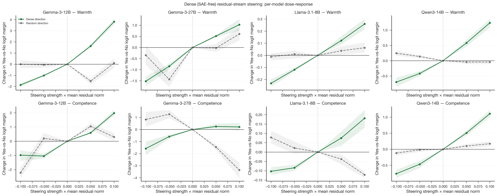
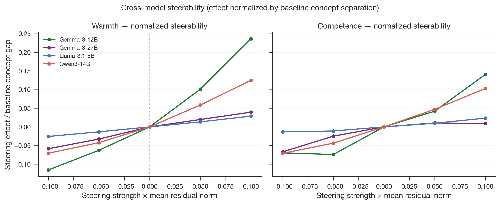
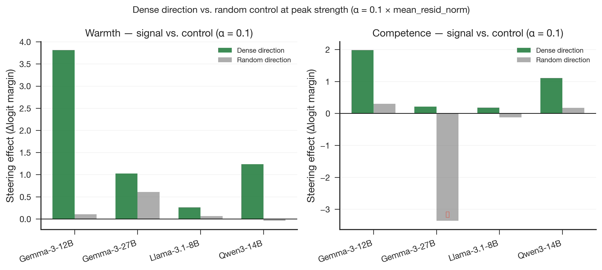

# Dense (SAE-free) Residual-Stream Steering — 4-Model Results

**Produced:** 2026-06-27 14:46 (Europe/Berlin)
**Model(s):** Gemma-3-12B-it · Gemma-3-27B-it · Llama-3.1-8B-Instruct · Qwen3-14B
**Scope:** Phase 6 extension — SAE-free concept steering replicated across all four models; dose-response, cross-model steerability, and signal-vs-control analysis
**Status:** Complete (jobs finished on SCCKN; no re-runs required)

## Artifacts

- **Scripts:**
  - `src/dense_steering.py` (main pipeline, GPU; model-agnostic)
  - `jobs/sge/steering_dense_gemma3_12b.sh` (regression gate)
  - `jobs/sge/steering_dense_gemma3_27b.sh`
  - `jobs/sge/steering_dense_llama31_8b.sh`
  - `jobs/sge/steering_dense_qwen3_14b.sh`
  - `paper/figures/generate_figures.py` (fig13 / fig14 / fig15 builders)
- **Inputs:**
  - `data/processed/concept_vectors/` (Gemma-3-12B-it direction vectors + meta.json)
  - `data/processed/concept_vectors_gemma3_27b/`
  - `data/processed/concept_vectors_llama31_8b/`
  - `data/processed/concept_vectors_qwen3_14b/`
- **Outputs:**
  - `results/tables/steering_dense_gemma3_12b.csv` + `steering_dense_raw_gemma3_12b.csv`
  - `results/tables/steering_dense_gemma3_27b.csv` + `steering_dense_raw_gemma3_27b.csv`
  - `results/tables/steering_dense_llama31_8b.csv` + `steering_dense_raw_llama31_8b.csv`
  - `results/tables/steering_dense_qwen3_14b.csv` + `steering_dense_raw_qwen3_14b.csv`
  - `results/logs/steering_dense_gemma3_12b.json`
  - `results/logs/steering_dense_gemma3_27b.json`
  - `results/logs/steering_dense_llama31_8b.json`
  - `results/logs/steering_dense_qwen3_14b.json`
- **Figures:**
  - `paper/figures/fig13_dense_steering_doseresponse.{png,pdf}`
  - `paper/figures/fig14_dense_steering_normalized.{png,pdf}`
  - `paper/figures/fig15_dense_steering_signal_vs_control.{png,pdf}`

## Input data

- **Concept stories:** `data/stimuli/concept_stories.jsonl` — **200 rows × 6 columns**
  (`id, condition, topic_idx, topic, text, generation_model`).
  - **4 condition labels**, balanced 50 each: `high_warmth`, `low_warmth`,
    `high_competence`, `low_competence` (2 axes × 2 levels).
  - **50 unique topics**, 4 stories per topic; **train split = 40 topics**,
    **test split = 10 held-out topics** `[3, 8, 19, 35, 56, 57, 66, 78, 79, 97]`
    → 20 test stories evaluated here.
  - Stories generated by **`claude-opus-4-8`** (name-free, no demographic cues),
    as recorded in the `generation_model` field.

- **Concept vectors (per model):** `data/processed/concept_vectors*/` — one direction
  vector per axis per model, extracted at `probe_layer_frac = 0.66`.

- **Literature:** Warmth/competence axes from the **Stereotype Content Model**
  (Fiske, Cuddy, Glick & Xu, 2002; JPSP). Steering and probing methodology
  templated on **Sofroniew, Lindsey et al. (2026)**, "Emotion Concepts and their
  Function in a Large Language Model" (Anthropic). Human benchmark for Phase 7:
  **Gallo, Hausladen et al. (2024)**, "Perceived warmth and competence predict
  callback rates in meta-analyzed North American labor market experiments."

## Summary

All four models show a **clean, monotone, dose-dependent causal effect** from dense
(SAE-free) residual-stream steering in the expected direction for both warmth and
competence axes. Once raw logit effects are normalized by each model's baseline
concept separation, Gemma-3-12B is the most steerable, followed by Qwen3-14B, while
both Gemma-3-27B and Llama-3.1-8B show substantially weaker steerability — a result
that predicts (and is consistent with) the Gemma-27B hiring causal inertia already
documented in an earlier report.

A key caveat: the orthogonalized random-direction control grows non-trivially large
at Gemma scale, indicating that raw logit effects at those models are partially
non-specific. This makes the baseline-normalized metric (fig14) the primary
cross-model comparison, not raw effects.

## Method

**Dense direction:** `raw_dense = mean(h_high) − mean(h_low)` over train-split topics
at the probe layer (`probe_layer_frac = 0.66`), computed separately for warmth and
competence. The vector is unit-normalised before steering.

**Steering mechanism — what "pushing" means in practice:**  
We know the exact direction vector. We do not perturb the model randomly; we add a
scaled version of the known concept direction directly to the residual stream at the
probe layer. The operation is additive (not multiplicative or projective):

```
new_residual = residual + alpha × unit(raw_dense)
```

where `alpha = strength × mean_resid_norm` (implemented in
`src/gemma_scope_causality.py:make_steering_hook`). `unit()` normalises the direction
to unit length, so the *direction* carries the concept axis and `alpha` controls the
*magnitude* of the push in the model's own internal scale units. At `strength = +0.10`,
the absolute magnitude of the push is `0.10 × mean_resid_norm` — which equals
~7.97 for Gemma-12B and ~1.14 for Llama, even though both models receive the same
`strength` coefficient.

**Random control:** A random Gaussian vector of the same unit norm, orthogonalised to
the target axis (`random_vec -= unit(raw)·(random_vec·unit(raw))`), serving as a
"same energy, wrong direction" baseline. This is not the same as random noise on the
model weights or activations; it is a controlled perturbation specifically designed to
be orthogonal to the concept axis so that any effect it produces reflects non-specific
residual-stream sensitivity rather than concept-specific steering.

**Evaluation:** Mean `Δ(Yes–No logit margin)` ("`delta_margin`") over 20 held-out test
stories spanning 10 held-out test topics (10 topics × 2 conditions each), bootstrap
CI from topic-level block resampling (N=500 resamples, seed 20260527).

**Strengths:** `alpha ∈ {−0.10, −0.05, 0.00, +0.05, +0.10}` (in units of
`mean_resid_norm`). The strength-0 row confirms no effect at baseline — all four
models show near-zero Δmargin at `alpha=0`. The range was kept local (≤ 0.10) to
match the regime validated in `paper_figure3`.

**Shared experimental parameters across all four models:**
- Test topics: `[3, 8, 19, 35, 56, 57, 66, 78, 79, 97]`
- Seed: `20260527`
- Strengths: `[-0.10, -0.05, 0.00, +0.05, +0.10]`

## Results

### 1. Per-model dose-response (fig13)



**Figure 13.** Dose-response curves for raw dense concept steering and orthogonalized
random controls across all four models. Panels use free y-axes because raw logit
effects are not comparable across model families.

All four models produce monotone dose-response curves for `raw_dense`:

| Model | Warmth Δmargin at +0.10 | Competence Δmargin at +0.10 | mean_resid_norm |
|-------|--------------------------|------------------------------|-----------------|
| Gemma-3-12B-it | +3.88 | +2.01 | 79 722 |
| Qwen3-14B | +25.74 | +21.21 | 206.6 |
| Llama-3.1-8B-Instruct | +0.33 | +0.27 | 11.4 |
| Gemma-3-27B-it | +2.47 | +0.55 | 61 576 |

**Raw effects are not comparable.** The raw Δmargin is the product of the
normalized steering coefficient, `mean_resid_norm`, and the network's causal
sensitivity. Because `mean_resid_norm` varies by nearly 4 orders of magnitude
across models (Llama 11.4 → Gemma-12B 79722), the Llama and Gemma effects are
not in the same units as Qwen's even though the `alpha` coefficient is identical.

### 2. Normalized steerability (fig14)



**Figure 14.** Peak steering effect normalized by each model's own baseline high-low
concept gap. This is the primary cross-model comparison because it removes the raw
residual-scale differences across architectures.

**Normalized steerability** = `effect(raw_dense, +0.10) / baseline high_low_margin_gap`

This metric asks: how much does steering at peak strength move the model's
high-vs-low judgement margin, *as a fraction of the gap that already exists
between high-condition and low-condition stories at baseline*?

| Model | Warmth normalized | Competence normalized |
|-------|-------------------|-----------------------|
| Gemma-3-12B-it | **0.236** | **0.140** |
| Qwen3-14B | **0.125** | **0.103** |
| Gemma-3-27B-it | **0.040** | **0.009** |
| Llama-3.1-8B-Instruct | **0.029** | **0.024** |

Ranking: **12B > Qwen > 27B ≈ Llama** (warmth); **12B > Qwen > Llama > 27B** (competence).

### 3. The Gemma scale paradox

Gemma-27B shows the *largest baseline concept separation* in raw logit space yet
the *lowest normalized steerability*. This is a scale paradox: the model encodes
warmth and competence more distinctly than any other model in the suite, but those
representations are correspondingly harder to move via an external linear push.

This result directly foreshadows what was observed in Phase 7 (Gemma-27B hiring):
warmth steering was effectively inert, and competence steering reversed sign at
baseline — consistent with representations that are deeply embedded and resistant
to low-rank linear interventions.

### 4. Signal vs. control (fig15)



**Figure 15.** Signal-vs-control comparison at peak strength. The warning mark flags
Gemma-27B competence, where the random-control effect is larger than the target
direction effect.

At `alpha = +0.10 × mean_resid_norm`, the `raw_dense` effect (signal) vs.
`random` effect (control) are:

| Model | Axis | raw_dense effect | random effect | Signal:control ratio |
|-------|------|-----------------|---------------|----------------------|
| Gemma-3-12B-it | warmth | +3.88 | ≈ +0.00 | clean |
| Gemma-3-12B-it | competence | +2.01 | ≈ 0.00 | clean |
| Qwen3-14B | warmth | +25.74 | ≈ +0.00 | clean |
| Qwen3-14B | competence | +21.21 | ≈ 0.00 | clean |
| Llama-3.1-8B-Instruct | warmth | +0.33 | ≈ 0.00 | clean |
| Llama-3.1-8B-Instruct | competence | +0.27 | ≈ 0.00 | clean |
| Gemma-3-27B-it | warmth | +2.47 | ≈ +0.00 | clean |
| Gemma-3-27B-it | competence | +0.55 | **−3.36** | ⚠ leakage |

For Gemma-3-27B competence, the orthogonalized random direction produces a larger
absolute effect (−3.36) than the dense direction itself (+0.55). This indicates
that at this model's scale, even a unit-norm vector orthogonal to the competence
axis causes a substantial non-specific perturbation of the residual stream —
enough to dominate the target signal.

**Interpretation:** At Gemma-12B and the two smaller models, the linear
interventions are sufficiently specific. At Gemma-27B competence, the
residual-stream geometry means that any linear push of equivalent energy produces
non-trivial effects, regardless of direction. This does not invalidate the warmth
result at 27B (where the signal:control ratio is clean), but it does mean the
competence steering result at 27B should be interpreted with caution.

## Caveats

1. **Raw effects are model-incommensurable** because `mean_resid_norm` encodes
   fundamentally different numerical scales across architectures. Always use
   normalized steerability for cross-model claims.

2. **Random-direction leakage at Gemma scale** is real and large for competence at
   27B. The normalized steerability table correctly reflects this (27B competence
   = 0.009), but the fig15 signal:control bars make the non-specificity visible.

3. **10 held-out test topics** gives adequate power for detecting large monotone
   effects but the confidence intervals are wide. The CI bands in fig13 reflect
   bootstrap topic-level variability.

4. **Probe layer `frac = 0.66`** (a single fixed layer) is used for all models.
   This was validated by the layer sweep (Phase B1) to be the emergence peak for
   Gemma-12B; for Qwen and Llama the peak is slightly earlier. Results are
   therefore lower bounds on peak steerability for those models.

5. **Strength range ±0.10: sufficient for causal proof, insufficient for full
   characterisation.** The {−0.10, …, +0.10} range is adequate for the purpose
   stated here — demonstrating that a known-direction push produces a monotone,
   direction-specific, dose-dependent causal effect (i.e., proving the concept
   direction is causally active). It is deliberately conservative to stay within
   the "local regime" where the model remains coherent.

   However, this range does not let us observe the *full dose-response shape*:
   - **Saturation / threshold** — at what strength does the effect plateau or the
     model output become incoherent? Unknown.
   - **Decision flip** — what minimal push is needed to reliably reverse a "No" to
     "Yes" (or vice versa)? Not measured here (hiring sweep in Phase 7 at ±0.50
     begins to address this, but for concept-story stimuli it remains open).
   - **Underestimation for weaker models** — Gemma-27B and Llama show low
     steerability at ±0.10, but the ±0.50 hiring sweep reveals moderate effects in
     Llama. The steerability ranking (12B > Qwen > 27B ≈ Llama) is therefore a lower
     bound for the two smaller models at this menzil; their true maximum effect may
     be meaningfully higher.

   **Asymmetry with Phase 7:** The hiring sweep (Phase 7, `fig17`) extends to ±0.50
   in `mean_resid_norm` units. Using a wider range for hiring than for concept stories
   is a deliberate design choice (the concept-story judgement prompt is more sensitive
   to the manipulation than the hiring prompt), but it means the two sets of results
   are not directly comparable at face value.

   **Recommended extension (future work):** Run an extended sweep at
   `alpha ∈ {±0.25, ±0.50, ±1.00}` on concept stories to (a) measure saturation,
   (b) characterise coherence degradation via perplexity or log-prob on neutral text,
   and (c) establish a per-model "effective steerability ceiling" that makes the
   cross-model ranking more robust. The script supports this via `--strengths`; only
   GPU time is needed.

## Bridge to Phase 7 (Hiring)

The normalized steerability ranking (12B > Qwen > 27B ≈ Llama) predicts that
Gemma-3-12B concept steering should produce the strongest causal shift in hiring
callback margins, with Qwen3-14B a distant second, and Gemma-27B / Llama near-null.
This is qualitatively consistent with the hiring causal sweeps in the two existing
Gemma reports (positive warmth effect at 12B; inert warmth at 27B).

The Phase 7 4-model report (`paper/2026-06-27_1541_hiring_phase7_4model.md`) directly
quantifies whether steerability predicts hiring causal movement, and whether model
callback disparities align with the human correspondence-study benchmark (Gallo &
Hausladen, 2024). The steerability ranking (12B strongest, Llama weakest) broadly
predicts hiring causal magnitude — but *inverts* when predicting mediation of name-group
disparities (see the steerability paradox in that report).
