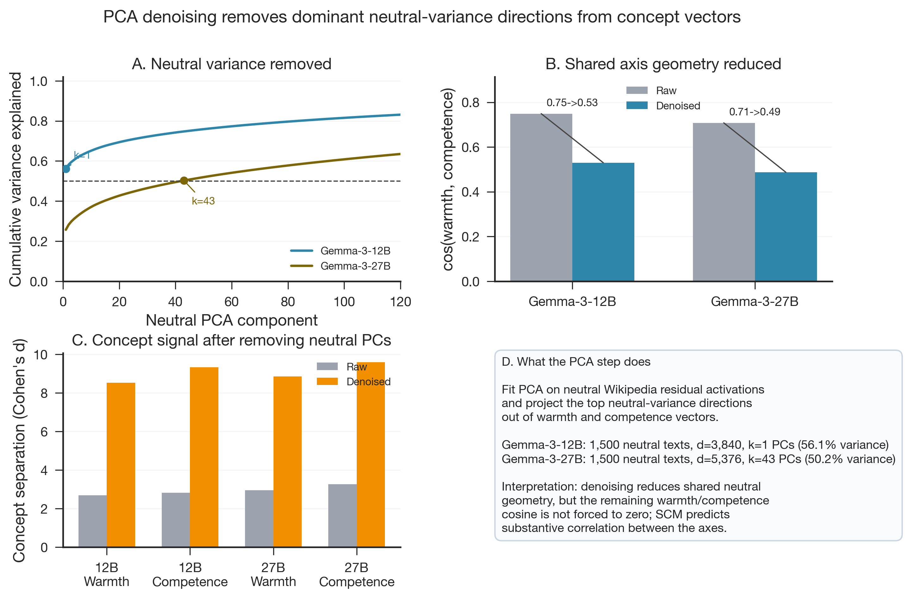

# PCA Denoising of Warmth/Competence Concept Vectors

**Produced:** 2026-07-02 19:21 (Europe/Berlin)
**Model(s):** Gemma-3-12B-it · Gemma-3-27B-it
**Scope:** PCA denoising against neutral Wikipedia residual activations
**Status:** Complete

## Artifacts

- **Scripts:** `scripts/build_neutral_corpus.py`; `src/extract_neutral.py`; `src/denoise_vectors.py`; `notebooks/08_valence_denoising.ipynb`; `paper/figures/generate_figures.py`
- **Inputs:** `data/stimuli/neutral_corpus.jsonl`; `data/processed/concept_vectors/`; `data/processed/concept_vectors_gemma3_27b/`
- **Outputs:** `data/processed/concept_vectors/concept_vectors_denoised.npz`; `data/processed/concept_vectors/denoise_summary.json`; `data/processed/concept_vectors_gemma3_27b/concept_vectors_denoised.npz`; `data/processed/concept_vectors_gemma3_27b/denoise_summary.json`
- **Figures:** `paper/figures/fig20_pca_denoising.{png,pdf}`

## Summary

PCA denoising was run as a neutral-corpus control for the Gemma-family warmth and competence vectors. The procedure fits PCA on neutral Wikipedia residual activations and projects the top neutral-variance PCs out of the concept vectors until at least 50% of neutral variance is covered.

## Results

| Model | Neutral texts | Layer width | PCs removed | Neutral variance covered | cos(W,C) raw | cos(W,C) denoised |
|---|---:|---:|---:|---:|---:|---:|
| Gemma-3-12B-it | 1,500 | 3,840 | 1 | 56.1% | 0.749 | 0.530 |
| Gemma-3-27B-it | 1,500 | 5,376 | 43 | 50.2% | 0.708 | 0.487 |

| Model | Warmth d raw | Warmth d denoised | Competence d raw | Competence d denoised |
|---|---:|---:|---:|---:|
| Gemma-3-12B-it | 2.70 | 8.53 | 2.83 | 9.33 |
| Gemma-3-27B-it | 2.95 | 8.86 | 3.27 | 9.60 |

## Interpretation

The PCA step removes a large shared neutral-variance direction from the Gemma concept vectors, especially in 12B where a single PC covers 56.1% of the neutral residual variance. In 27B, the same 50% threshold is distributed across 43 PCs, suggesting a less concentrated neutral-variance subspace.

Denoising reduces the warmth/competence cosine substantially in both models, from 0.749 to 0.530 in 12B and from 0.708 to 0.487 in 27B. This supports the interpretation that some of the raw shared geometry was neutral residual structure rather than concept-specific SCM geometry.

The denoising does not force the axes to be orthogonal. The remaining positive cosine is compatible with the substantive warmth/competence correlation expected in the Stereotype Content Model and in the human benchmark ratings. The result should therefore be reported as a neutral-variance control, not as proof that the vectors isolate pure warmth and pure competence.

## Caveats

This figure uses existing denoising artifacts and concept-story activations only; it is not a new human-rating validation and does not replace the probe-vs-human analysis. The denoised vectors should also be interpreted separately from the main dense steering results unless the corresponding steering CSV explicitly uses the `_denoised` suffix.
