# Probing Warmth and Competence in Gemma 4 Models
## Stage 1 — Extraction Geometry Across Three Model Sizes

**Produced at:** 18 July 2026, 13:08 Europe/Berlin
**Model:** Gemma-4-12B-it · Gemma-4-26B-A4B-it · Gemma-4-31B-it
**Scope:** Stage 1 — residual-stream extraction geometry (vector norms, cosine(W,C), null-distribution separation, weight concentration)
**Status:** Complete for all three models. CV-accuracy and Cohen's d numbers shown here are computed directly from Stage 1 activations as a geometry sanity check; the authoritative Stage 2/3 pipeline results live in the reports listed under §7.

---

## Artifacts

- **Scripts:** `src/extract_vectors.py`, `paper/figures/generate_figures.py`
- **Inputs:** `data/processed/concept_vectors_gemma4_12b/`, `data/processed/concept_vectors_gemma4_26b_a4b/`, `data/processed/concept_vectors_gemma4_31b/` (each: `warmth_vec.npy`, `competence_vec.npy`, `X_high_warmth.npy`, `X_low_warmth.npy`, `X_high_competence.npy`, `X_low_competence.npy`, `meta.json`)
- **Outputs:** `data/processed/concept_vectors_gemma4_12b/meta.json`, `data/processed/concept_vectors_gemma4_26b_a4b/meta.json`, `data/processed/concept_vectors_gemma4_31b/meta.json` — Stage 1 has no CSV/JSON metric table of its own; the numbers in §4–§6 below are recomputed directly from the `.npy` vectors at report time, not read from a separate results file
- **Figures:** `paper/figures/gemma4_12b/fig1_joint_density.{png,pdf}`, `paper/figures/gemma4_12b/fig2_random_baseline.{png,pdf}`, `paper/figures/gemma4_12b/fig3_lorenz_concentration.{png,pdf}`, `paper/figures/gemma4_12b/fig4_axis_geometry.{png,pdf}`; the same four files under `paper/figures/gemma4_26b_a4b/` and `paper/figures/gemma4_31b/`

---

## Summary of Findings

1. Stage 1 extraction succeeded for all three Gemma 4 models. Warmth and competence direction vectors were built from 200 concept stories at each model's configured probe layer (`probing.probe_layer_frac = 0.66`).
2. All three models place their warmth and competence directions far outside the null distribution of 1,000 random directions in the same residual space: random-baseline *z*-scores range from 8.6 to 15.0, all with *p* < .001 (0 of 1,000 random directions matched or exceeded the extracted direction).
3. The warmth–competence cosine similarity is positive and moderate in all three models (0.494–0.587), replicating the shared-valence pattern already documented for Gemma-3 at Stage 1: the intended story contrasts are strongly separated, but the two extracted axes are not orthogonal.
4. Vector norms scale with `d_model` in an uneven way. 31B (d=5376) has the largest absolute norms (warmth 12.10, competence 15.08), while 26B-A4B has the largest norms relative to its model's mean residual-stream norm. Raw and scale-normalised norms therefore describe different aspects of the geometry rather than one model-size ranking.
5. Coordinate-wise weight concentration (Lorenz curves) differs sharply by model. 26B-A4B places 50% of the warmth vector's squared norm in 64 dimensions, compared with 261 for 12B and 303 for 31B. This 4–5× difference is a descriptive property of the residual coordinates, not by itself a model-invariant estimate of effective dimensionality.
6. A same-layer 1-D projection sanity check (5-fold CV, using only the Stage 1 `.npy` arrays) shows near-perfect separability for all three models on both the target and cross-axis, consistent with the shared-valence finding in point 3 — this is not the Stage 2 pipeline number, see caveats.

---

## 1. What Stage 1 Produces and Why It Matters on Its Own

The project's mental model runs extraction (Stage 1) → probe validation (Stage 2) → layer sweep (Stage 3) → steering. Stage 1's only job is to turn 200 short warmth/competence stories into two residual-stream direction vectors per model — a `warmth_vec` and a `competence_vec` — by taking the mean-difference between high- and low-condition activations at one fixed probe layer (`src/extract_vectors.py`).

This report isolates that step. The question is not "does the probe generalise" (Stage 2) or "at which depth does the signal peak" (Stage 3), but a narrower one: **what does the raw extracted geometry look like, on its own, for three different Gemma 4 sizes?** Vector norms, the angle between the two concept directions, how many dimensions carry the signal, and how far the extracted direction sits from a random direction in the same space are all properties of the extraction step itself, before any cross-validation or layer scan is applied.

---

## 2. Extraction Setup

| | Gemma-4-12B-it | Gemma-4-26B-A4B-it | Gemma-4-31B-it |
|---|---|---|---|
| `probe_layer` | 31 | 19 | 39 |
| `n_layers` | 48 | 30 | 60 |
| `probe_layer / (n_layers - 1)` | 0.660 | 0.655 | 0.661 |
| `d_model` | 3,840 | 2,816 | 5,376 |
| Stories per condition | 50 | 50 | 50 |
| Total stories | 200 | 200 | 200 |
| Input format | raw-passage | raw-passage | raw-passage |
| Start token (skip prefix) | 50 | 50 | 50 |
| Seed | 20260527 | 20260527 | 20260527 |
| dtype | bfloat16 | bfloat16 | bfloat16 |
| Backend | transformer-bridge | transformer-bridge | transformer-bridge |
| TransformerLens / Transformers / Torch | 3.5.1 / 5.13.0 / 2.13.0+cu130 | 3.5.1 / 5.13.0 / 2.13.0+cu130 | 3.5.1 / 5.13.0 / 2.13.0+cu130 |

All three runs used the identical stimulus set, seed, and prompt format; the only varying factor is the model itself and its resulting probe layer (`probing.probe_layer_frac = 0.66` of each model's own depth, per `config/config.yaml`).

---

## 3. Method Recap

Direction vectors were built as in the original Gemma-3-12B Stage 1 run (`2026-06-16_2001_concept_stories_probe_findings.md`):

```
warmth vector     = mean(activations | high_warmth)  −  mean(activations | low_warmth)
competence vector = mean(activations | high_competence)  −  mean(activations | low_competence)
```

Four figures were generated per model with `paper/figures/generate_figures.py --fig 1,2,3,4 --vec-dir data/processed/concept_vectors_<label> --out-dir paper/figures/<label>`, the same single-model code path already used for Gemma-3-12B, Qwen3-14B, and Llama-3.1-8B:

- **Fig. 1 — joint density:** z-scored projections of all 200 stories onto the warmth and competence directions.
- **Fig. 2 — random baseline:** Cohen's d of the extracted direction against a null of 1,000 random unit directions in the same residual space.
- **Fig. 3 — Lorenz concentration:** cumulative fraction of squared vector norm captured by the top-*k* dimensions, sorted by contribution.
- **Fig. 4 — axis geometry:** cosine similarity between the two directions plus a 5-fold cross-validated 1-D projection accuracy heatmap (on-diagonal: target axis; off-diagonal: cross-axis).

---

## 4. Gemma-4-12B-it

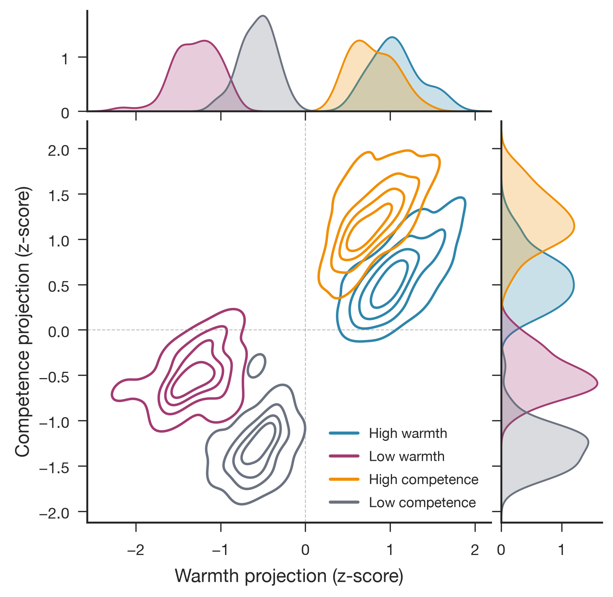

**Figure G12-1.** Joint density of the 200 stories projected onto the warmth (x) and competence (y) axes, z-scored. As in the Gemma-3 baseline, the four conditions separate along their intended contrasts but also sit on a shared positive/negative diagonal.

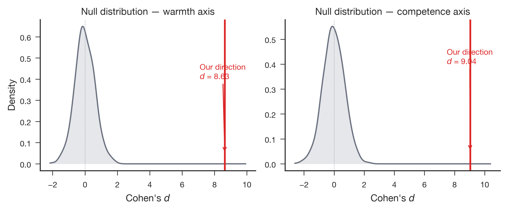

**Figure G12-2.** Null distribution of Cohen's d for 1,000 random directions versus the extracted warmth (*d* = 8.63, *z* = 14.1) and competence (*d* = 9.04, *z* = 12.8) directions. Zero of 1,000 random directions reached either extracted value.

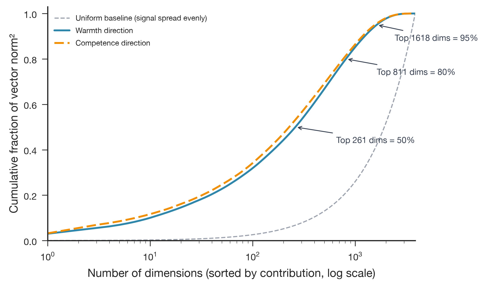

**Figure G12-3.** Cumulative squared-norm concentration. Half of the warmth vector's norm sits in its top 261 of 3,840 dimensions (6.8%); half of the competence vector's norm sits in its top 227 dimensions (5.9%). Both curves rise well above the uniform-baseline diagonal, so the signal is concentrated but still spread across hundreds of dimensions rather than a handful.

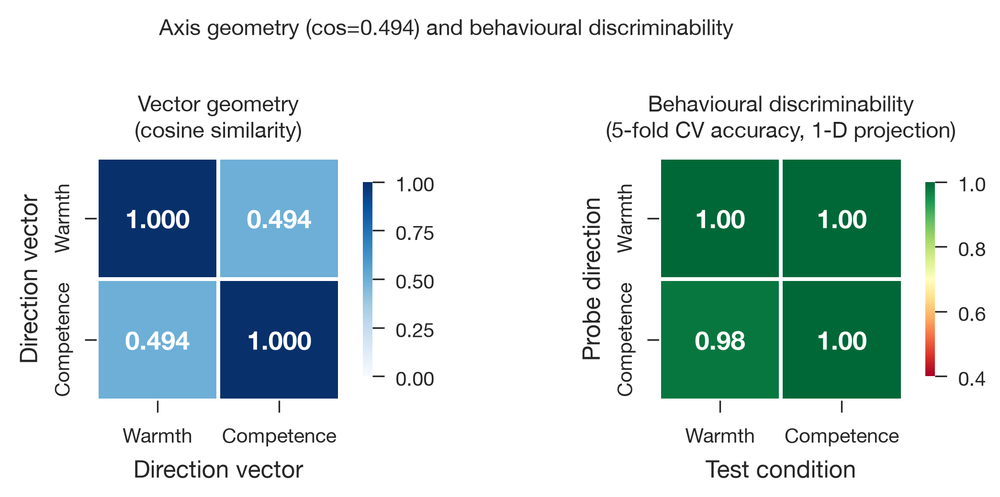

**Figure G12-4.** cos(warmth, competence) = 0.494. The 1-D projection sanity check reaches 100% CV accuracy for warmth-on-warmth and competence-on-competence and remains high off-diagonal (warmth-on-competence 100%, competence-on-warmth 98%), which is expected given the moderate cosine and mirrors the shared-valence pattern already reported for Gemma-3-12B.

At layer 31 (66% depth), 12B is intermediate in the absolute number of coordinates needed to carry 50% of the signal, but it has the broadest proportional spread: 6.8% of its coordinates for warmth and 5.9% for competence. It does not have the largest dimension-scaled norm; that comparison is reported explicitly in §7.

---

## 5. Gemma-4-26B-A4B-it

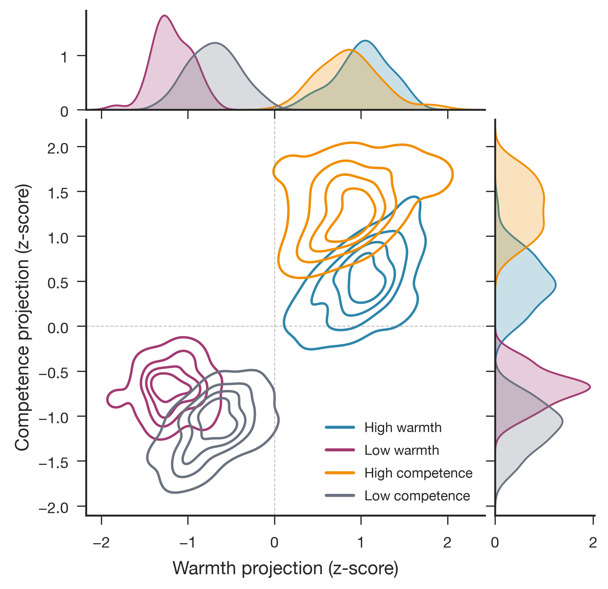

**Figure G26-1.** Joint density at layer 19 (30 layers total). Condition separation and the shared-valence diagonal are visible in the same pattern as 12B.

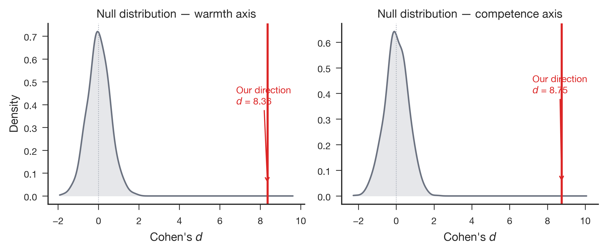

**Figure G26-2.** Extracted directions: warmth *d* = 8.36 (*z* = 15.0), competence *d* = 8.75 (*z* = 14.3) — the largest *z*-scores of the three models, meaning the extracted directions are proportionally furthest from this model's random-direction null.

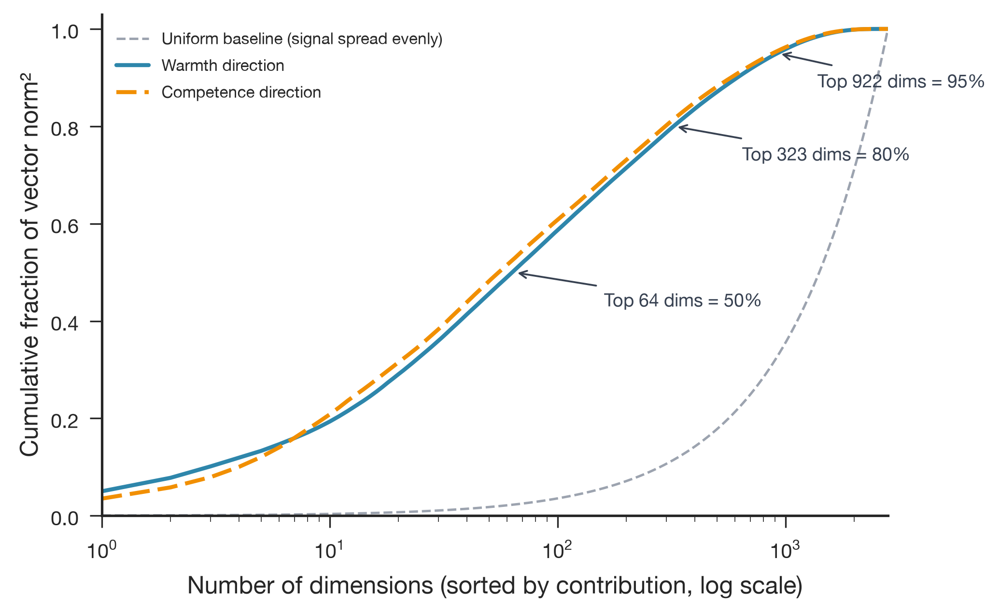

**Figure G26-3.** Sharply more concentrated than 12B or 31B: 50% of the warmth vector's squared norm sits in only 64 of 2,816 dimensions (2.3%), and 50% of competence sits in 56 dimensions (2.0%). This is roughly a 4× tighter concentration than 12B at the same 50% mark.

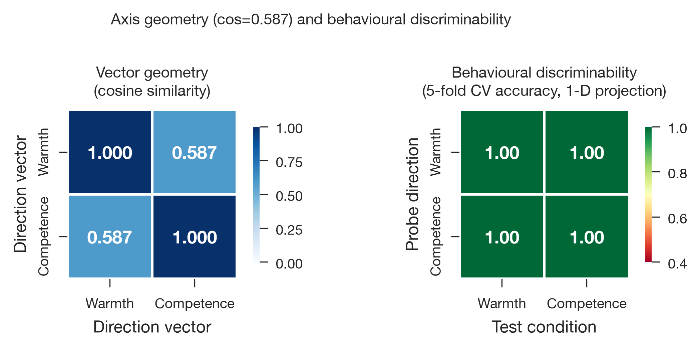

**Figure G26-4.** cos(warmth, competence) = 0.587, the highest of the three models — the two axes are geometrically closer together here than in 12B or 31B. All four CV cells (on- and off-diagonal) reach 100%.

26B-A4B is a mixture-of-experts model (A4B = ~4B active parameters) with the smallest `d_model` (2,816) of the three. Its combination of the highest random-baseline *z*-scores, the tightest coordinate concentration, and the highest cosine similarity is consistent with an architecture-related difference from the two dense models. The present extraction observes only the shared residual stream, not router decisions or expert activations, so it cannot determine whether the concentration is caused by MoE routing or establish a more compact underlying encoding.

---

## 6. Gemma-4-31B-it

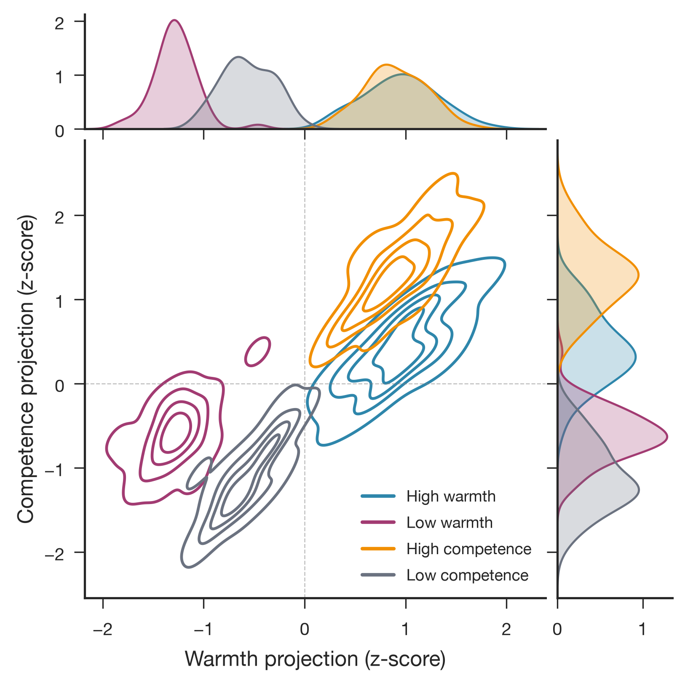

**Figure G31-1.** Joint density at layer 39 (60 layers total, the deepest and largest of the three models by `d_model`).

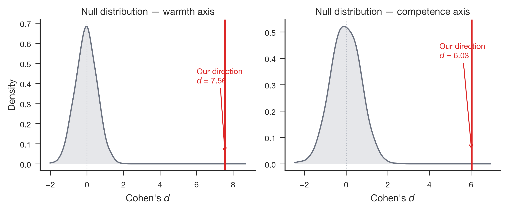

**Figure G31-2.** Extracted directions: warmth *d* = 7.56 (*z* = 13.1), competence *d* = 6.03 (*z* = 8.6) — the smallest competence *z*-score of the three models, though still 0 of 1,000 random directions reached it.

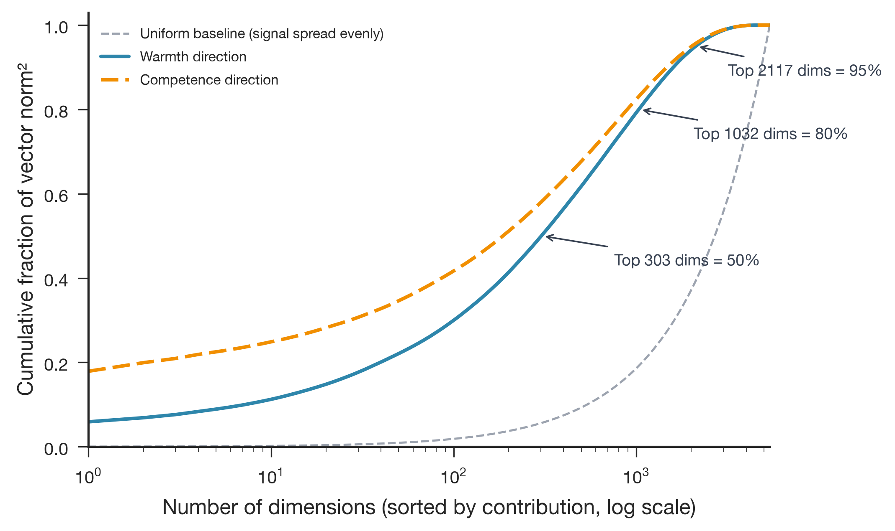

**Figure G31-3.** 50% of the warmth vector's squared norm sits in 303 of 5,376 dimensions (5.6%); competence needs only 186 dimensions (3.5%) for the same mark. Competence is more concentrated than warmth, the same ordering as in 12B, but the difference between the two axes is larger in 31B.

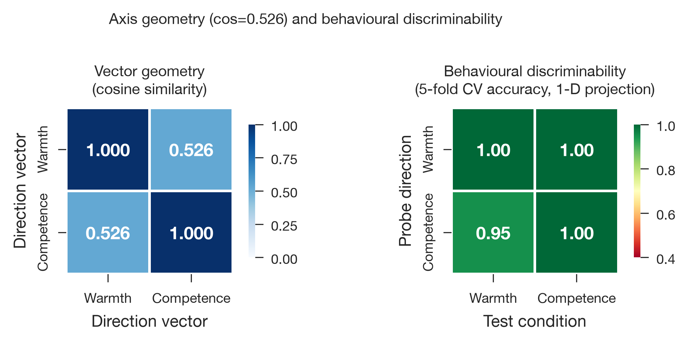

**Figure G31-4.** cos(warmth, competence) = 0.526. CV accuracy is 100% on-diagonal and on warmth-on-competence, but drops to 95% for competence-on-warmth — the only off-diagonal cell below 100% among the three models, though still far above chance.

31B has the largest `d_model` and the largest absolute vector norms of the three models, consistent with norms scaling with hidden size within this comparison, but its competence direction shows the weakest random-baseline separation and the one imperfect cross-axis CV cell — a first hint (to be confirmed, not concluded, by Stage 2/3) that the competence signal may be comparatively less crisp in 31B at this probe layer.

---

## 7. Cross-Model Comparison

| Metric | Gemma-4-12B-it | Gemma-4-26B-A4B-it | Gemma-4-31B-it |
|---|---|---|---|
| `d_model` | 3,840 | 2,816 | 5,376 |
| Probe layer index / final layer index | 31/47 (66%) | 19/29 (66%) | 39/59 (66%) |
| ‖warmth‖ | 7.978977 | 7.082840 | 12.099694 |
| ‖competence‖ | 9.316758 | 8.581815 | 15.081271 |
| Mean residual norm, E[‖h‖] | 97.8189 | 68.4368 | 188.5253 |
| ‖vector‖ / √`d_model` (warmth / competence) | 0.129 / 0.150 | 0.133 / 0.162 | 0.165 / 0.206 |
| ‖vector‖ / E[‖h‖] (warmth / competence) | 0.0816 / 0.0952 | 0.1035 / 0.1254 | 0.0642 / 0.0800 |
| cos(warmth, competence) | 0.494 | 0.587 | 0.526 |
| Warmth: random-baseline Cohen's *d* | 8.63 | 8.36 | 7.56 |
| Warmth: random-baseline *z* | 14.1 | 15.0 | 13.1 |
| Competence: random-baseline Cohen's *d* | 9.04 | 8.75 | 6.03 |
| Competence: random-baseline *z* | 12.8 | 14.3 | 8.6 |
| Warmth: dims for 50% of squared norm | 261 (6.8%) | 64 (2.3%) | 303 (5.6%) |
| Competence: dims for 50% of squared norm | 227 (5.9%) | 56 (2.0%) | 186 (3.5%) |
| 1-D CV (target axis, on-diagonal) | 100% / 100% | 100% / 100% | 100% / 100% |
| 1-D CV (cross-axis, off-diagonal) | 100% / 98% | 100% / 100% | 100% / 95% |

All three models show large, highly significant separation of warmth and competence from a random-direction null at Stage 1, and all three show a positive, moderate warmth–competence cosine rather than orthogonality. Within that shared pattern, the three models differ on where the norm mass concentrates and on the exact size of the effect, with 26B-A4B standing out as the most concentrated and the most cross-axis-entangled (highest cosine, all CV cells at 100%), and 31B showing the one below-ceiling cross-axis CV cell alongside the weakest competence random-baseline separation.

The norm comparison depends on scale. 31B has the largest raw norms and remains largest after division by √`d_model`, whereas 26B-A4B has the largest direction norms relative to its own typical residual-stream norm. These normalisations answer different questions and do not support a single ranking of representational strength. The 26B-A4B concentration result is therefore best treated as a robust coordinate-level observation and a possible MoE-related architectural signature, not as proof that the model encodes the concepts more compactly.

Near-perfect cross-axis accuracy is not discriminant validation. A warmth direction that also separates high- from low-competence stories, and vice versa, is consistent with both directions carrying a shared positive/negative person-evaluation component. Stage 1 establishes strong separation of the synthetic contrasts, but it cannot determine how much axis-specific warmth or competence information remains after that common valence component is controlled.

---

## 8. Caveats

- **CV-accuracy numbers here are a Stage 1 sanity check, not the Stage 2 result.** The 1-D projection CV values in §4–§7 are computed directly from the Stage 1 `.npy` arrays using the same `projected_cv_accuracy` routine `generate_figures.py` calls for its own Fig. 4 heatmap. They are consistent with, but not identical in method to, the full multi-dimensional probe validation reported in `2026-07-18_1208_gemma4_stage3_layer_sweep.md` and the Stage 2 numbers embedded in that report's probe-layer rows. Treat this report's CV numbers as an extraction-geometry sanity check, not the authoritative Stage 2 metric.
- **Construct specificity remains unresolved.** cos(warmth, competence) ranging from 0.49 to 0.59 replicates the shared-valence pattern documented for Gemma-3, Qwen3, and Llama. Non-orthogonality alone does not show that warmth and competence are indistinguishable, but the 0.95–1.00 cross-axis accuracies mean that target-axis separability cannot be treated as evidence that the directions are construct-specific. Valence-matched stimuli, human ratings, or an analysis that explicitly removes the shared evaluative component are needed to establish discriminant validity.
- **Synthetic single-axis stimuli.** The stories were written to vary one dimension while leaving the other unspecified (see the original Stage 1 methodology). The extraction geometry reported here reflects that stimulus design and should not be read as a claim about naturally occurring text.
- **Hardware note (12B only).** The 12B Stage 1 activations used to build the vectors in this report were extracted before the L40-vs-L40S Stage 3 hardware drift was discovered (`2026-07-18_1244_gemma4_12b_stage3_l40_reproducibility.md`). The exact-L40 Stage 3 audit reproduced this report's 12B Stage 2 probe-layer numbers to six decimal places, so the Stage 1 vectors underlying this report are not implicated in that drift; the drift was isolated to the L40S Stage 3 all-layer sweep only.
- **Three models, one seed.** All comparisons use a single extraction run per model (seed 20260527); no repeated-extraction variance estimate exists at Stage 1. Run-to-run stability at the probe layer is addressed separately by the Stage 3 reproducibility audit for 12B only.

---

## 9. Relation to Stage 2 and Stage 3

This report covers Stage 1 in isolation. The corresponding validated results are:

- **Stage 2 (probe validation, multi-dimensional CV + Cohen's d):** embedded as the probe-layer rows in `2026-07-18_1208_gemma4_stage3_layer_sweep.md` (26B-A4B, 31B) and `2026-07-18_1244_gemma4_12b_stage3_l40_reproducibility.md` (12B).
- **Stage 3 (all-layer sweep):** `2026-07-18_1208_gemma4_stage3_layer_sweep.md` (26B-A4B: peak *d* at layer 16; 31B: peak *d* at layer 24) and `2026-07-18_1244_gemma4_12b_stage3_l40_reproducibility.md` (12B: peak *d* at layers 26–27, exact-L40 vs. L40S hardware comparison).

Whether the Gemma 4 depth profiles from Stage 3 should be added to the manuscript's cross-model layer-emergence figure (`paper/figures/fig8_layer_emergence.png` / `paper_figure2_layer_emergence.png`) remains an open decision noted in the Stage 3 12B report and not addressed here.
