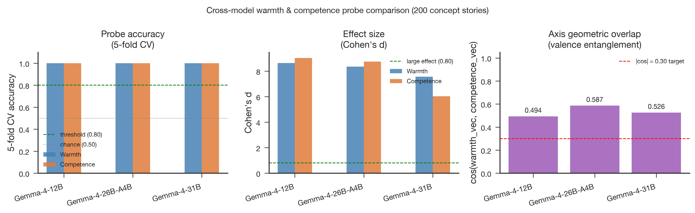
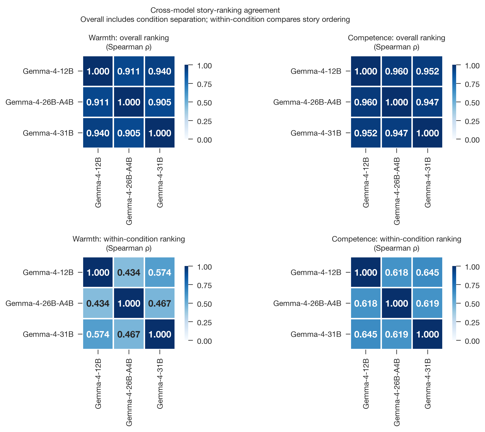
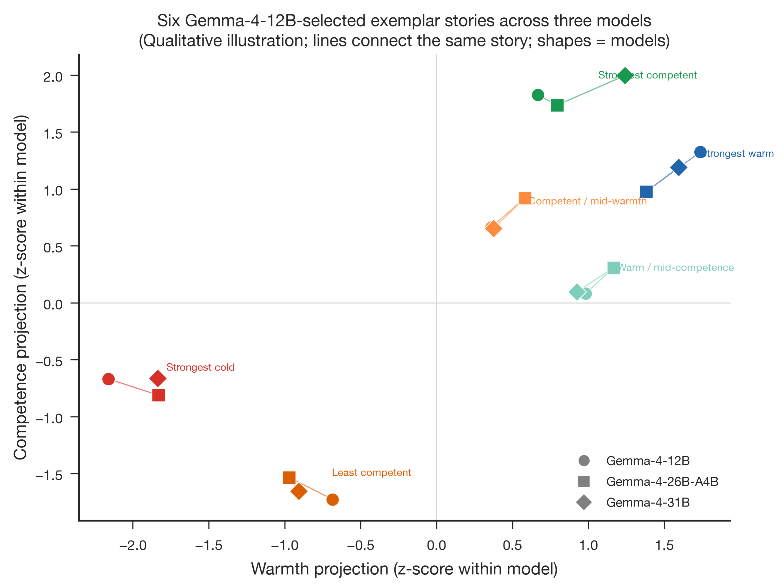

# Probing Warmth and Competence in Gemma 4 Models
## Stage 2 — Probe Validation Across Three Model Variants

**Produced at:** 18 July 2026, 13:26 Europe/Berlin
**Model:** Gemma-4-12B-it · Gemma-4-26B-A4B-it · Gemma-4-31B-it
**Scope:** Stage 2 — probe validation (full-feature and direction-specific topic holdout, descriptive Cohen's d, cross-axis transfer, cross-model agreement)
**Status:** Complete for all three models. This report distinguishes full-feature probeability, held-out validation of the extracted direction, target-calibrated cross-axis separation, and topic-held-out transfer without target recalibration.

---

## Artifacts

- **Scripts:** `src/validate_probes.py`, `src/validate_cross_model_agreement.py`, `paper/figures/generate_figures.py`
- **Inputs:** `data/stimuli/concept_stories.jsonl`; `data/processed/concept_vectors_gemma4_12b/`, `data/processed/concept_vectors_gemma4_26b_a4b/`, `data/processed/concept_vectors_gemma4_31b/`
- **Outputs:** `results/tables/probe_metrics_gemma4_12b.csv`, `results/tables/probe_metrics_gemma4_26b_a4b.csv`, `results/tables/probe_metrics_gemma4_31b.csv`, `results/tables/probe_story_agreement_gemma4.csv`; `results/logs/validate_probes_gemma4_12b.json`, `results/logs/validate_probes_gemma4_26b_a4b.json`, `results/logs/validate_probes_gemma4_31b.json`
- **Figures:** `paper/figures/gemma4_cross/fig5_cross_model.{png,pdf}`, `paper/figures/gemma4_cross/fig6_cross_model_story_agreement.{png,pdf}`, `paper/figures/gemma4_cross/fig7_same_story_demo.{png,pdf}`

---

## Summary of Findings

1. Full-feature 5-fold and topic-holdout cross-validation reach 100% for warmth and competence in all three variants. This establishes strong linear probeability on unseen topics within the same synthetic story-generation distribution.
2. A stricter topic-holdout test rebuilds the mean-difference direction using only training topics before classifying held-out topics. It also reaches 100% in all six model-axis combinations, directly validating the Stage 1 direction-construction rule rather than only the availability of some linear separator.
3. Descriptive Cohen's d is largest for 12B on both warmth (8.63) and competence (9.04), intermediate for 26B-A4B (8.36/8.75), and smallest for 31B (7.56/6.03). These values use the full-data extracted direction and are not held-out effect estimates.
4. **Headline finding — generalization with shared evaluative signal:** topic-held-out cross-axis transfer remains high without fitting or recalibrating on the target axis. Warmth→competence / competence→warmth accuracy is 0.99/0.97 for 12B, 0.99/0.95 for 26B-A4B, and 0.95/0.88 for 31B. The shared signal is strong but not identical across variants or transfer direction.
5. The positive warmth–competence cosine (0.494–0.587) and target-calibrated fixed-direction CV (0.95–1.00) support the same shared-valence interpretation, but the calibrated metric is not a zero-shot transfer test because its decision boundary is fitted on target-axis training folds.
6. Overall cross-model story-ranking correlations are 0.905–0.940 for warmth and 0.947–0.960 for competence. After removing the four condition-level rank differences, agreement is more moderate: 0.434–0.574 for warmth and 0.618–0.645 for competence. The models agree strongly on the broad condition ordering and moderately on which stories rank higher within a condition.

---

## 1. What Stage 2 Validates and Why It Matters on Its Own

Stage 1 (`2026-07-18_1308_gemma4_stage1_extraction_geometry.md`) established the raw extraction geometry and reported Cohen's d as a same-array descriptive sanity check. It deferred generalization and construct-specificity claims to later validation.

Stage 2 asks three distinct questions. Full-feature CV tests whether the activation space contains a linear separator that generalizes to held-out stories. Direction-specific topic CV rebuilds the exact mean-difference direction inside each training fold and tests it on unseen topics. Cross-axis topic transfer goes further: it learns the direction and decision rule on one construct and applies both to held-out topics from the other construct without seeing target-axis labels during fitting. Cohen's d remains a descriptive full-data separation measure and is interpreted separately from these held-out tests.

---

## 2. Validation Setup

| | Gemma-4-12B-it | Gemma-4-26B-A4B-it | Gemma-4-31B-it |
|---|---|---|---|
| `probe_layer` / `n_layers` | 31 / 48 | 19 / 30 | 39 / 60 |
| `d_model` | 3,840 | 2,816 | 5,376 |
| Stories per condition | 50 | 50 | 50 |
| Total stories | 200 | 200 | 200 |
| CV scheme | 5-fold + topic-holdout | 5-fold + topic-holdout | 5-fold + topic-holdout |
| Seed | 20260527 | 20260527 | 20260527 |
| dtype | bfloat16 | bfloat16 | bfloat16 |
| Backend | transformer-bridge | transformer-bridge | transformer-bridge |
| TransformerLens / Transformers / Torch | 3.5.1 / 5.13.0 / 2.13.0+cu130 | 3.5.1 / 5.13.0 / 2.13.0+cu130 | 3.5.1 / 5.13.0 / 2.13.0+cu130 |

All three runs used the identical stimulus set, seed, and validation code, differing only in the model and its configured probe layer (`probing.probe_layer_frac = 0.66`).

---

## 3. Per-Model Validation Results

### 3.1 Gemma-4-12B-it

Warmth projections separate cleanly (high mean 19.571 ± 0.965 vs. low mean 11.592 ± 0.881, Cohen's d = 8.634); competence projections separate even more strongly (high mean 26.656 ± 1.119 vs. low mean 17.340 ± 0.935, Cohen's d = 9.035). Full-feature, topic-holdout, and direction-specific topic CV all reach 100% for both axes. Target-calibrated fixed-direction CV is 100% warmth-on-competence and 98% competence-on-warmth. The stricter topic-held-out transfer is 99% warmth→competence and 97% competence→warmth. `axis_cosine` is 0.494, the lowest of the three variants.

### 3.2 Gemma-4-26B-A4B-it

Warmth separates from a mean of 6.925 ± 0.972 (high) to −0.158 ± 0.701 (low), Cohen's d = 8.357; competence separates from 11.942 ± 1.046 (high) to 3.360 ± 0.910 (low), Cohen's d = 8.754. All three target-axis CV variants reach 100%. Both target-calibrated cross-axis directions also reach 100%, whereas topic-held-out transfer is 99% warmth→competence and 95% competence→warmth. `axis_cosine` is 0.587, the highest of the three variants. This is the mixture-of-experts model in the set (approximately 4B active parameters) and should not be treated as a simple dense-model scale step.

### 3.3 Gemma-4-31B-it

Warmth separates from 53.496 ± 1.937 (high) to 41.396 ± 1.170 (low), Cohen's d = 7.562; competence separates from 89.946 ± 2.513 (high) to 74.865 ± 2.487 (low), the weakest effect size in the report at d = 6.032. All three target-axis CV variants remain at 100%. Target-calibrated fixed-direction CV is 100% warmth-on-competence and 95% competence-on-warmth. Topic-held-out transfer drops to 95% warmth→competence and 88% competence→warmth, the lowest transfer result and clearest asymmetry among the variants. `axis_cosine` is 0.526.

---

## 4. Cross-Model Figures

**Figure 5.** Grouped bars for 5-fold CV accuracy, Cohen's d, and cos(W,C) across Gemma-4-12B, Gemma-4-26B-A4B, and Gemma-4-31B. The CV panel is flat at ceiling for all three models and both axes, so it cannot distinguish them; the Cohen's d panel shows 31B's competence bar visibly shorter than the other five bars, and the cosine panel shows 26B-A4B's bar clearly the tallest of the three.

**Figure 6.** Four Spearman-ρ heatmaps separate overall agreement from within-condition agreement. Overall correlations exceed 0.90 because they include the shared ordering of the four experimental conditions. After each story is ranked only against the other 49 stories in its condition, warmth agreement is 0.434–0.574 and competence agreement is 0.618–0.645. The variants therefore share the broad condition structure and retain moderate, rather than near-perfect, agreement about individual stories within conditions.

**Figure 7.** Six stories selected by within-condition extremeness in the 12B reference model, including two cross-axis sanity cases, are plotted in each variant's z-scored warmth/competence space. This is a qualitative illustration of selected examples, not an independent validation statistic.

---

## 5. Cross-Model Comparison

| Metric | Gemma-4-12B-it | Gemma-4-26B-A4B-it | Gemma-4-31B-it |
|---|---|---|---|
| Warmth Cohen's *d* | 8.634 | 8.357 | 7.562 |
| Competence Cohen's *d* | 9.035 | 8.754 | 6.032 |
| Warmth 5-fold CV | 1.00 | 1.00 | 1.00 |
| Competence 5-fold CV | 1.00 | 1.00 | 1.00 |
| Warmth topic-holdout CV | 1.00 | 1.00 | 1.00 |
| Competence topic-holdout CV | 1.00 | 1.00 | 1.00 |
| Warmth direction-specific topic CV | 1.00 | 1.00 | 1.00 |
| Competence direction-specific topic CV | 1.00 | 1.00 | 1.00 |
| `axis_cosine` (W,C) | 0.494 | 0.587 | 0.526 |
| Target-calibrated fixed direction: warmth-on-competence | 1.00 | 1.00 | 1.00 |
| Target-calibrated fixed direction: competence-on-warmth | 0.98 | 1.00 | 0.95 |
| Topic-held-out transfer: warmth→competence | 0.99 | 0.99 | 0.95 |
| Topic-held-out transfer: competence→warmth | 0.97 | 0.95 | 0.88 |
| `pass_orthogonality` | false | false | false |
| Warmth overall ρ vs. other variants | 0.911 / 0.940 | 0.911 / 0.905 | 0.940 / 0.905 |
| Warmth within-condition ρ | 0.434 / 0.574 | 0.434 / 0.467 | 0.574 / 0.467 |
| Competence overall ρ vs. other variants | 0.960 / 0.952 | 0.960 / 0.947 | 0.952 / 0.947 |
| Competence within-condition ρ | 0.618 / 0.645 | 0.618 / 0.619 | 0.645 / 0.619 |

All numbers in this table are read from the tracked Stage 2 CSV/JSON artifacts listed above, including `probe_story_agreement_gemma4.csv`; none depend only on transient terminal output.

---

## 6. Entanglement Discussion

The three variants converge on two results. First, warmth and competence remain perfectly separable on unseen topics within the synthetic distribution, both for unrestricted full-feature classifiers and for mean-difference directions rebuilt inside each topic fold. Second, none passes the orthogonality check, and a decision rule trained on one axis transfers to the other at 88–99% accuracy without target-axis fitting.

Read together, these results show that the synthetic contrasts are individually learnable while sharing a transferable positive/negative person-evaluation component. High target-axis separability and cross-axis transfer are compatible when warmth and competence contain a shared valence component plus smaller axis-specific components. The weaker 31B competence→warmth transfer indicates that the overlap is substantial but not complete or symmetric. Stage 1 observed the same pattern in cosine similarity; Stage 3 shows that the cosine rises further near the middle of the network before declining.

The cross-model agreement analysis adds a second distinction. Overall ρ above 0.90 shows that all variants reproduce the broad experimental condition ordering. Within-condition ρ of 0.43–0.65 shows more modest agreement about the relative placement of individual stories after that designed ordering is removed. This supports cross-variant consistency, not independent convergent validity of the psychological constructs.

The practical consequence for later phases of this project is that a large Cohen's d or CV accuracy on one axis is not, by itself, evidence that the model treats warmth and competence as independent internal constructs. Steering one direction should be expected to have some effect on the other, and any causal callback experiment should report both the intended-axis effect and the cross-axis leakage rather than one axis in isolation.

---

## 7. Caveats

- **Target-axis CV is at ceiling and therefore not a discriminating metric.** Full-feature, topic-holdout, and direction-specific topic CV all equal 1.00. They establish within-distribution generalization but cannot rank the variants.
- **Cohen's d is descriptive rather than held-out.** The direction and effect size are calculated from the same 100 stories for each axis. The values describe full-sample separation and should not be read as independent test-set effect estimates.
- **Construct specificity remains unresolved.** `pass_orthogonality = false`, cosine 0.49–0.59, and cross-axis transfer up to 0.99 are not model failures, but they are discriminant-validity warnings for treating warmth and competence as independent directions.
- **Synthetic single-axis stimuli.** As in Stage 1, the 200 stories were written to vary one dimension while leaving the other unspecified; the validation results reflect that stimulus design and should not be generalized to naturally occurring text without further testing.
- **Cross-model agreement is not independent convergent validity.** All three variants belong to the same Gemma 4 family and process the same synthetic stimuli. Overall agreement also includes the designed high/low condition differences; the within-condition metric is the more specific story-ranking comparison.
- **Discriminant and external validation remain pending.** This report validates internal separability and generalization to unseen topics. It does not test correlation against human warmth/competence ratings or causal effects on hiring callback decisions; those are separate, later phases of the pipeline (see the Done Criteria in `AGENTS.md`).
- **Single seed.** All three runs use seed 20260527 with no repeated-run variance estimate at Stage 2. The Stage 3 reproducibility audit (`2026-07-18_1244_gemma4_12b_stage3_l40_reproducibility.md`) reproduces the 12B Stage 2 numbers in a separate exact-L40 run and observes small drift on L40S, but neither run varies the seed.

---

## 8. Relation to Stage 1 and Stage 3

- **Stage 1 (extraction geometry):** `2026-07-18_1308_gemma4_stage1_extraction_geometry.md`. Its full-data direction geometry and descriptive Cohen's d agree with this report; Stage 2 adds full-feature, direction-specific, and transfer validation on held-out topics.
- **Stage 3 (all-layer sweep):** `2026-07-18_1208_gemma4_stage3_layer_sweep.md` (26B-A4B and 31B) and `2026-07-18_1244_gemma4_12b_stage3_l40_reproducibility.md` (12B). Both confirm that the configured 0.66-depth probe layer reproduces this report's Cohen's d values exactly, and both show the axis cosine peaking higher in the mid-network than at the configured probe layer, reinforcing the entanglement finding in §6 above.
