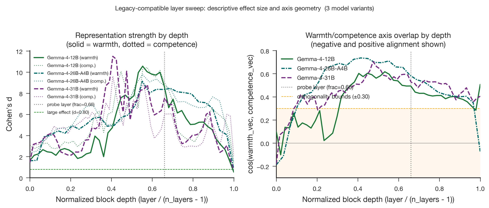

# Gemma 4 Stage 3 layer sweep: consolidated three-model depth profile

- **Produced:** 2026-07-18 13:40 Europe/Berlin
- **Models:** `google/gemma-4-12B-it`, `google/gemma-4-26B-A4B-it`, `google/gemma-4-31B-it`
- **Scope:** Stage 3 all-layer warmth and competence probe sweep on 200 synthetic concept stories, consolidated across all three Gemma 4 model sizes, with the 12B hardware-reproducibility audit folded in as a validity check
- **Status:** Complete legacy-compatible reference. Stage 3B (`2026-07-18_1453`) now supplies the all-layer direction-specific validation, strict cross-axis transfer, and paired-topic uncertainty that this descriptive sweep did not include. 12B is reported here using the exact-L40 result, which reproduces Stage 2 with zero difference; the earlier L40S result is retained as a numerical-reproducibility comparison, not as the canonical 12B figure.

## Artifacts

- **Scripts:** `src/layer_sweep.py`, `src/validate_gemma4_stage.py`, `paper/figures/generate_figures.py`
- **Inputs:** `data/stimuli/concept_stories.jsonl`, `config/config.yaml`, `results/tables/probe_metrics_gemma4_{12b,26b_a4b,31b}.csv`, `results/logs/validate_probes_gemma4_{12b,26b_a4b,31b}.json`
- **Outputs:** `results/tables/layer_sweep_gemma4_12b_l40_repro.csv`, `results/tables/layer_sweep_gemma4_12b_l40_repro.meta.json`, `results/tables/layer_sweep_gemma4_12b.csv`, `results/tables/layer_sweep_gemma4_12b.meta.json`, `results/tables/layer_sweep_gemma4_26b_a4b.csv`, `results/tables/layer_sweep_gemma4_26b_a4b.meta.json`, `results/tables/layer_sweep_gemma4_31b.csv`, `results/tables/layer_sweep_gemma4_31b.meta.json`
- **Figures:** `paper/figures/gemma4_cross/fig8_layer_emergence.png`, `paper/figures/gemma4_cross/fig8_layer_emergence.pdf`
- **Prior reports (superseded for cross-model comparison purposes, retained for their hardware/execution detail):** `paper/2026-07-18_1208_gemma4_stage3_layer_sweep.md` (26B-A4B and 31B), `paper/2026-07-18_1244_gemma4_12b_stage3_l40_reproducibility.md` (12B, L40/L40S audit)

## Summary of Findings

1. At the configured 0.66-depth probe layer, all three variants have large descriptive effect sizes and full-feature topic-holdout CV = 1.00 for both axes. The unrestricted classifier also reaches 1.00 at earlier middle layers.
2. Full-feature topic-holdout accuracy is already high after the first transformer block: warmth is 0.82/0.80/0.84 and competence is 0.96/0.94/0.95 for 12B/26B-A4B/31B. The signal is therefore not a late-onset phenomenon in this synthetic distribution.
3. Descriptive effect sizes peak before the configured probe layer in all three variants. Warmth peaks at fractions 0.55, 0.55, and 0.41; 12B competence peaks separately at fraction 0.57. These are in-sample maxima, not validated optimal steering layers.
4. The warmth/competence axis cosine varies substantially with depth. Its positive maximum occurs in the middle of each network, but the final value is close to the probe-layer cosine only for 12B: 26B-A4B changes from 0.587 to -0.075 and 31B from 0.526 to 0.405.
5. The 12B exact-L40 run reproduces the Stage 2 probe-layer numbers at six-decimal precision. L40/L40S differences leave the broad curve shape intact but are nontrivial at some layers, including a maximum competence-d difference of 0.914 and cosine difference of 0.095. With one run per device class, this is a hardware-associated numerical-sensitivity observation rather than an isolated hardware effect.
6. Figure 8 shows a family-consistent descriptive pattern across the three tested Gemma 4 variants. It does not establish a general architectural law or a monotonic scale effect, particularly because 26B-A4B is a mixture-of-experts model rather than a dense intermediate scale step.

## 1. What Stage 3 adds beyond Stage 1 and Stage 2

Stage 1 (`2026-07-18_1308`) established the raw single-layer extraction geometry at the configured probe layer. Stage 2 (`2026-07-18_1326`) validated that layer using both unrestricted and mean-difference-direction tests. This legacy-compatible Stage 3 sweep maps descriptive effect size, unrestricted full-feature topic classification, and axis cosine across post-block residual states. It does not test the mean-difference direction or strict cross-axis transfer at every layer, so it identifies descriptive depth profiles rather than a uniquely best or most independent layer. The probe-layer row also provides a technical reproduction check against stored Stage 2 activations.

## 2. Sweep setup

| Model | n_layers | d_model | Probe layer / frac | n stories | Seed | dtype | Backend |
|---|---:|---:|---|---:|---:|---|---|
| Gemma 4 12B (exact-L40) | 48 | 3840 | 31 / 0.6596 | 200 | 20260527 | bfloat16 | transformer-bridge, TransformerLens 3.5.1 |
| Gemma 4 12B (L40S) | 48 | 3840 | 31 / 0.6596 | 200 | 20260527 | bfloat16 | transformer-bridge, TransformerLens 3.5.1 |
| Gemma 4 26B-A4B | 30 | 2816 | 19 / 0.6552 | 200 | 20260527 | bfloat16 | transformer-bridge, TransformerLens 3.5.1 |
| Gemma 4 31B | 60 | 5376 | 39 / 0.6610 | 200 | 20260527 | bfloat16 | transformer-bridge, TransformerLens 3.5.1 |

Each row reports full-feature topic-holdout CV, in-sample Cohen's d along a direction built from all 100 axis stories, cos(warmth_vec, competence_vec), and mean residual-stream norm. Layer 0 is the residual state after the first transformer block, not the embedding input.

## 3. Probe-layer reproduction against Stage 2

| Model | Probe layer | Warmth topic CV | Competence topic CV | Warmth d | Competence d | cos(W,C) |
|---|---:|---:|---:|---:|---:|---:|
| Stage 2 stored activations (12B) | 31/48 | 1.00 | 1.00 | 8.633730 | 9.035413 | 0.493539 |
| Stage 3 exact-L40 (12B) | 31/48 | 1.00 | 1.00 | 8.633730 | 9.035413 | 0.493539 |
| Stage 3 L40S (12B) | 31/48 | 1.00 | 1.00 | 8.461919 | 8.982933 | 0.492562 |
| Stage 2 stored activations (26B-A4B) | 19/30 | 1.00 | 1.00 | 8.357120 | 8.753860 | 0.586665 |
| Stage 3 sweep (26B-A4B) | 19/30 | 1.00 | 1.00 | 8.357120 | 8.753860 | 0.586665 |
| Stage 2 stored activations (31B) | 39/60 | 1.00 | 1.00 | 7.562413 | 6.031858 | 0.526157 |
| Stage 3 sweep (31B) | 39/60 | 1.00 | 1.00 | 7.562413 | 6.031858 | 0.526157 |

The exact-L40 sweep and the 26B-A4B/31B sweeps all reproduce Stage 2's stored-activation probe-layer numbers with zero difference at six-decimal precision. Only the 12B L40S run, executed on a different GPU model than the one used for Stage 1 extraction, shows numerical deviations. Section 6 treats these as hardware-associated sensitivity without attributing them solely to device class.

## 4. Depth profiles

| Model | Warmth peak layer / frac / d | Competence peak layer / frac / d | Cosine peak layer / frac / value | Final W d | Final C d | Final cosine |
|---|---|---|---|---:|---:|---:|
| 12B (exact-L40) | 26 / 0.5532 / 10.5631 | 27 / 0.5745 / 10.4457 | 25 / 0.5319 / 0.6168 | 0.5334 | 1.2703 | 0.5071 |
| 26B-A4B | 16 / 0.5517 / 9.1377 | 16 / 0.5517 / 9.7773 | 12 / 0.4138 / 0.7362 | 0.8001 | 1.4756 | -0.0752 |
| 31B | 24 / 0.4068 / 11.4946 | 24 / 0.4068 / 9.6113 | 28 / 0.4746 / 0.7046 | 0.7254 | 1.9932 | 0.4048 |

All descriptive d maxima occur before the configured probe layer. The cosine maximum is shallower than the d maximum for 12B and 26B-A4B, but deeper for 31B (layer 28 versus layer 24). Axis cosine, not separation, begins near zero or negative: 12B reaches -0.10 at layer 1, while 26B-A4B and 31B begin at -0.19 and -0.18.

## 5. Cross-model figure

The left panel plots descriptive Cohen's d against normalized block depth for all three variants, with references at d = 0.80 and the configured fraction 0.66. The right panel plots cosine geometry and preserves negative values, with the orthogonality target shown as the band between -0.30 and 0.30. All three curves reach a positive middle-layer maximum, but their early and final behavior differs, especially for 26B-A4B.

## 6. 12B hardware-reproducibility check (L40 vs L40S)

| Result | Warmth d | Competence d | cos(W,C) | Topic holdout W/C | Mean residual norm |
|---|---:|---:|---:|---:|---:|
| Stage 2 stored activations | 8.633730 | 9.035413 | 0.493539 | 1.00 / 1.00 | n/a |
| Stage 3 exact L40, layer 31 | 8.633730 | 9.035413 | 0.493539 | 1.00 / 1.00 | 97.8189 |
| Stage 3 L40S, layer 31 | 8.461919 | 8.982933 | 0.492562 | 1.00 / 1.00 | 97.8765 |

Stage 1 activations for 12B were extracted on an NVIDIA L40; a later retry ran on an L40S instead, so a separate exact-L40 audit was run to examine the discrepancy (full execution detail in `2026-07-18_1244`). Across all 48 layers, the largest absolute L40-vs-L40S deviation is 0.638 (warmth d), 0.914 (competence d), 0.095 (cosine), and 0.2366 residual-norm units. Both runs identify the same peak layer (26 for warmth, 27 for competence), the same qualitative topic-CV range (0.77–1.00), and a late-layer decline, although final competence d differs substantially (1.27 versus 2.18). The 12B row used throughout §3–§5 is the exact-L40 result because it is hardware-matched to Stage 1 and reproduces Stage 2. With only one run per device class, the comparison cannot isolate hardware from run-level nondeterminism.

## 7. Interpretation and caveats

The consolidated sweep supports depth-wide full-feature linear probeability in the tested synthetic distribution, with middle-layer amplification of descriptive d and cosine. It does not establish emergence from an initially neutral representation: after the first transformer block, warmth CV is already 0.80–0.84 and competence CV 0.94–0.96. Lexical and general evaluative structure may therefore contribute to the early signal.

The middle-layer cosine maximum reaches 0.74 in 26B-A4B, showing that geometric alignment is strongest near the region of high descriptive separation. Cosine alone does not establish shared valence or cross-axis transfer at every layer. This sweep adds no layer-wise direction-specific validation, cross-axis transfer, human-rating evidence, or hiring-decision evidence beyond Stage 2's configured layer.

The 12B L40/L40S comparison is a single-run-per-device-class observation, so run-to-run kernel nondeterminism on a fixed device is not separately estimated from the device-to-device difference. The broad descriptive pattern is stable across both 12B runs: perfect probe-layer full-feature topic holdout, large d values, pre-probe amplification, and a middle-layer cosine maximum. The larger late-layer differences prevent treating the comparison as negligible precision noise.

## 8. Relation to Stage 1 and Stage 2

This report supersedes `2026-07-18_1208_gemma4_stage3_layer_sweep.md` and `2026-07-18_1244_gemma4_12b_stage3_l40_reproducibility.md` as the reference for legacy-compatible cross-model Stage 3 comparison; those reports remain the source of record for execution details. See `2026-07-18_1308_gemma4_stage1_extraction_geometry.md` for the single-layer geometry and `2026-07-18_1326_gemma4_stage2_probe_validation.md` for direction-specific validation and strict cross-axis transfer at the configured layer. The Stage 3B report, `2026-07-18_1453_gemma4_stage3b_validation.md`, extends those stricter tests to every layer and quantifies topic-sampling uncertainty without changing the configured probe layer.
