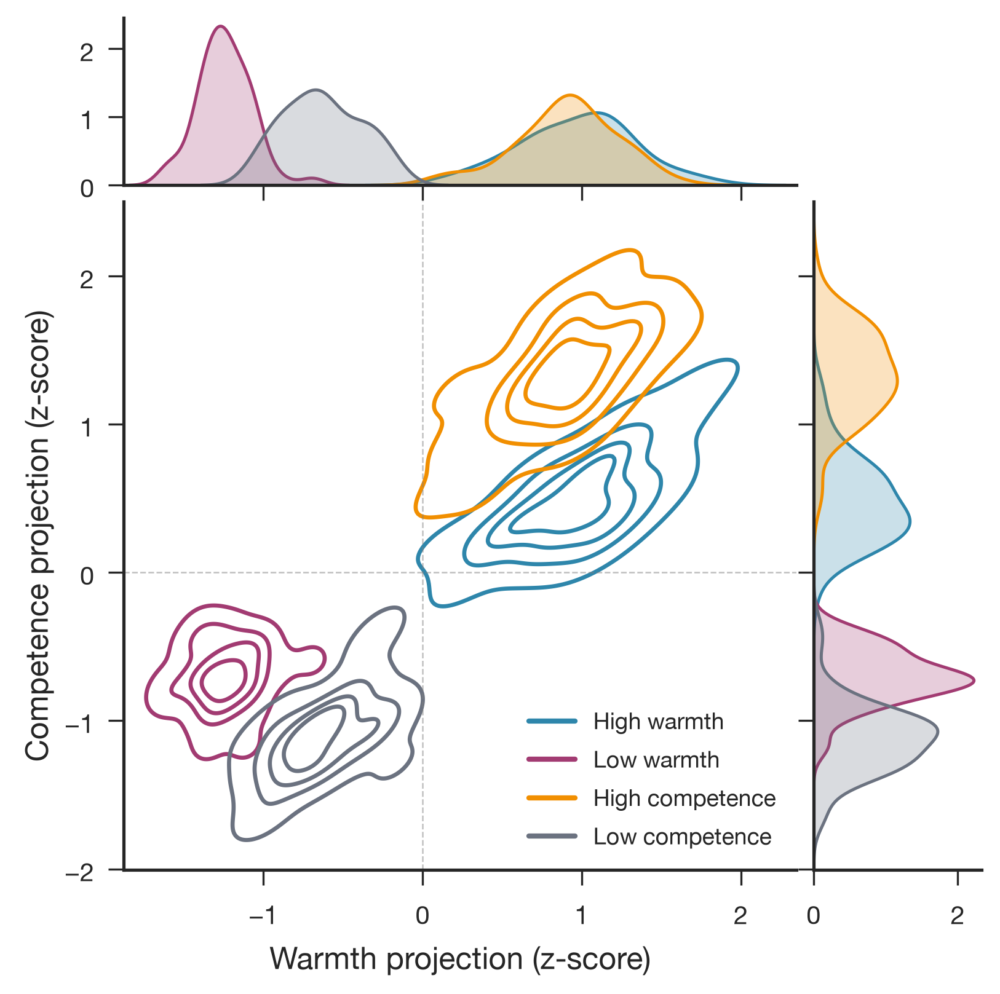
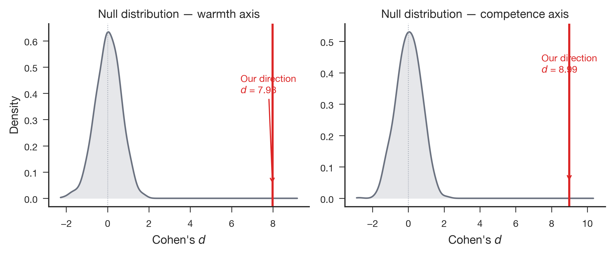

# Qwen3.6-27B Stage 1: Full-Corpus Extraction

- **Produced:** 2026-07-18 14:04 Europe/Berlin
- **Model:** Qwen/Qwen3.6-27B, revision `6a9e13bd6fc8f0983b9b99948120bc37f49c13e9`
- **Scope:** Stage 1 residual-stream extraction on 200 concept stories
- **Status:** Complete; technical gates passed

## Artifacts

- **Scripts:** `src/qwen36_pipeline.py`, `src/validate_qwen36_stage.py`, `jobs/sge/qwen36_stage.sh`
- **Inputs:** `config/qwen36_27b.yaml`, `data/stimuli/concept_stories.jsonl`
- **Outputs:** `data/processed/concept_vectors_qwen36_27b/`, `results/logs/qwen36_27b_stage1.json`
- **Figures:** `paper/figures/qwen36_27b/fig1_joint_density.{png,pdf}`, `paper/figures/qwen36_27b/fig2_random_baseline.{png,pdf}`, `paper/figures/qwen36_27b/fig3_lorenz_concentration.{png,pdf}`, `paper/figures/qwen36_27b/fig4_axis_geometry.{png,pdf}`

## Summary

The full 200-story extraction passed every technical gate using native Hugging Face hooks, without TransformerLens. The run used one RTX PRO 6000 in bfloat16, extracted the residual stream at zero-indexed layer 42 of 64 (`probe_layer_frac=0.66`), and produced 50 activation rows for each warmth and competence condition.

## Extraction results

| Quantity | Warmth | Competence |
|---|---:|---:|
| Direction norm | 8.540 | 10.211 |
| Random-baseline Cohen's d | 7.983 | 8.986 |
| Random-baseline z score | 12.9 | 12.9 |
| Dimensions carrying 50% squared norm | 173 / 5,120 | 112 / 5,120 |
| Dimensions carrying 80% squared norm | 1,008 / 5,120 | 838 / 5,120 |

Neither of 1,000 seeded random directions exceeded the extracted warmth or competence separation. The extracted axes nevertheless have cosine 0.580, above the prespecified low-overlap target of 0.30. The result therefore supports strong linear condition separation, but not construct independence.

## Technical validation

- Hooked activations matched the model's returned hidden states exactly (`max_diff=0.0`).
- A passive hook changed no output logits (`max_diff=0.0`).
- The vision tower was never called.
- Peak reserved GPU memory was 51.289 GiB, 54.0% of the 95.010 GiB device.
- Model execution took 40.477 seconds; Grid Engine reported `failed=0` and `exit_status=0`.
- The input contract was raw passage text with an explicit BOS token; token lengths ranged from 101 to 167.

## Interpretation and boundary

Stage 1 establishes that both target contrasts are strongly represented at the selected residual-stream layer and that the native-HF instrumentation is passive. The warmth and competence directions remain substantially entangled, so later causal steering must include cross-axis outcome checks. This report does not test hiring callbacks or causal effects.
