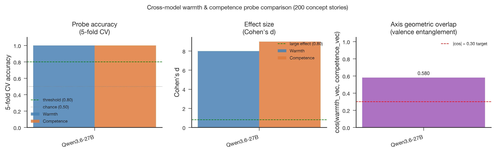

# Qwen3.6-27B Stage 2: Full-Corpus Probe Validation

- **Produced:** 2026-07-18 14:08 Europe/Berlin
- **Model:** Qwen/Qwen3.6-27B, revision `6a9e13bd6fc8f0983b9b99948120bc37f49c13e9`
- **Scope:** Stage 2 CPU validation of the Stage 1 activation matrices
- **Status:** Complete; technical and statistical gates passed

## Artifacts

- **Scripts:** `src/qwen36_pipeline.py`, `src/validate_probes.py`, `src/validate_qwen36_stage.py`, `jobs/sge/qwen36_stage.sh`
- **Inputs:** `config/qwen36_27b.yaml`, `data/processed/concept_vectors_qwen36_27b/`
- **Outputs:** `results/tables/probe_metrics_qwen36_27b.csv`, `results/logs/validate_probes_qwen36_27b.json`, `results/logs/qwen36_27b_stage2.json`
- **Figures:** `paper/figures/qwen36_27b/fig5_cross_model.{png,pdf}`

## Summary

Both warmth and competence probes achieved perfect accuracy under seeded five-fold cross-validation and stricter topic-held-out validation. Effect sizes were large, but the warmth and competence directions retained a cosine of 0.580 and failed the low-overlap criterion.

## Results

| Axis | Cohen's d | 5-fold CV | Topic-holdout CV | High-condition projection | Low-condition projection |
|---|---:|---:|---:|---:|---:|
| Warmth | 7.983 | 1.000 ± 0.000 | 1.000 ± 0.000 | 12.492 ± 1.368 | 3.952 ± 0.647 |
| Competence | 8.986 | 1.000 ± 0.000 | 1.000 ± 0.000 | 15.093 ± 1.272 | 4.882 ± 0.982 |

All five folds equaled 1.00 for both validation schemes and axes. Topic-held-out performance shows that condition separation is not limited to memorizing the story topics represented in the training folds. Because the current production validator reconstructs the full-feature linear probe, this result should be read as strong predictive validation, not proof that warmth and competence are independent causal variables.

## Reproducibility and execution

The CPU job used seed `20260527` and the same stimulus hash recorded by Stage 1. The analysis itself took 0.636 seconds. Grid Engine job `1145106` completed on `scc123` with `failed=0`, `exit_status=0`, 70 seconds wallclock, and 739 MiB maximum virtual memory. The independent cross-stage audit later reproduced both Cohen's d values and the axis cosine exactly within tolerance `1e-6`.

## Interpretation and boundary

The representation is highly probeable and generalizes across topics. Axis overlap remains the main construct-validity warning: a successful target-axis classifier does not demonstrate selective encoding. Subsequent steering should therefore report target and non-target changes together and compare against matched random controls.
