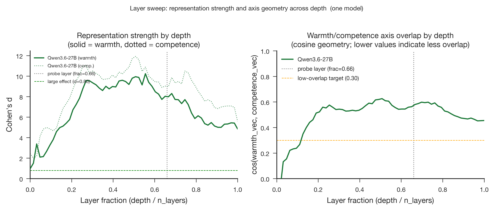

# Qwen3.6-27B Stage 3: Full-Corpus Layer Sweep

- **Produced:** 2026-07-18 14:08 Europe/Berlin
- **Model:** Qwen/Qwen3.6-27B, revision `6a9e13bd6fc8f0983b9b99948120bc37f49c13e9`
- **Scope:** Stage 3 all-layer residual-stream sweep on 200 concept stories
- **Status:** Complete; all 64 layers finite and cross-stage audit passed

## Artifacts

- **Scripts:** `src/qwen36_pipeline.py`, `src/validate_qwen36_stage.py`, `jobs/sge/qwen36_stage.sh`, `paper/figures/generate_figures.py`
- **Inputs:** `config/qwen36_27b.yaml`, `data/stimuli/concept_stories.jsonl`, `data/processed/concept_vectors_qwen36_27b/`
- **Outputs:** `results/tables/layer_sweep_qwen36_27b.csv`, `results/tables/layer_sweep_qwen36_27b.meta.json`, `results/logs/qwen36_27b_stage3.json`
- **Figures:** `paper/figures/qwen36_27b/fig8_layer_emergence.{png,pdf}`

## Summary

Warmth and competence separation emerged early, peaked near the middle of the network, and remained large at the final layer. Both axes reached their maximum Cohen's d before the fixed `probe_layer_frac=0.66` position. The selected probe layer is therefore conservative rather than peak-seeking.

## Depth profile

| Quantity | Peak layer | Peak fraction | Peak value | Probe-layer value (L42) | Final-layer value |
|---|---:|---:|---:|---:|---:|
| Warmth Cohen's d | 35 | 0.5556 | 10.232 | 7.983 | 4.839 |
| Competence Cohen's d | 32 | 0.5079 | 11.918 | 8.986 | 5.578 |
| cos(warmth, competence) | 32 | 0.5079 | 0.626 | 0.580 | 0.454 |

Topic-held-out accuracy was 1.00 at every layer for both axes. The cosine profile rises from approximately zero in the earliest layer, stays above the 0.30 low-overlap target through most of the network, and declines after its middle-layer maximum. This is evidence of depth-dependent shared geometry rather than permanent orthogonality.

## Technical validation

All 64 rows were finite and uniquely indexed. At layer 42, Stage 3 reproduced Stage 2 warmth d, competence d, and axis cosine with zero absolute difference at tolerance `1e-6`. Hook/hidden-state parity and passive-logit parity were exact, and no vision calls occurred. Peak reserved memory was 51.348 GiB, 54.0% of the RTX PRO 6000. Grid Engine job `1145108` completed with `failed=0`, `exit_status=0`, 90 seconds wallclock, and 46.125 GiB maximum virtual memory.

## Interpretation and boundary

The fixed two-thirds-depth probe layer captures strong, stable signal while avoiding post hoc selection at the observed peaks. The decline toward the final layer also confirms that final-layer-only probing would understate the maximum encoded separation. This sweep remains descriptive and does not establish a causal link to callback decisions.
