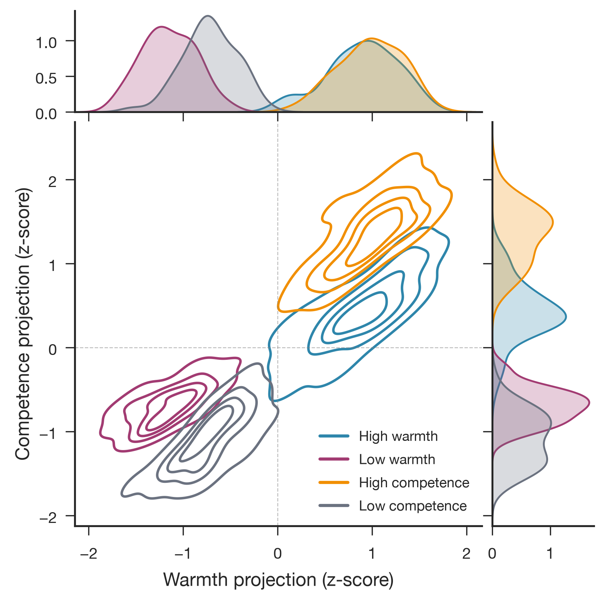
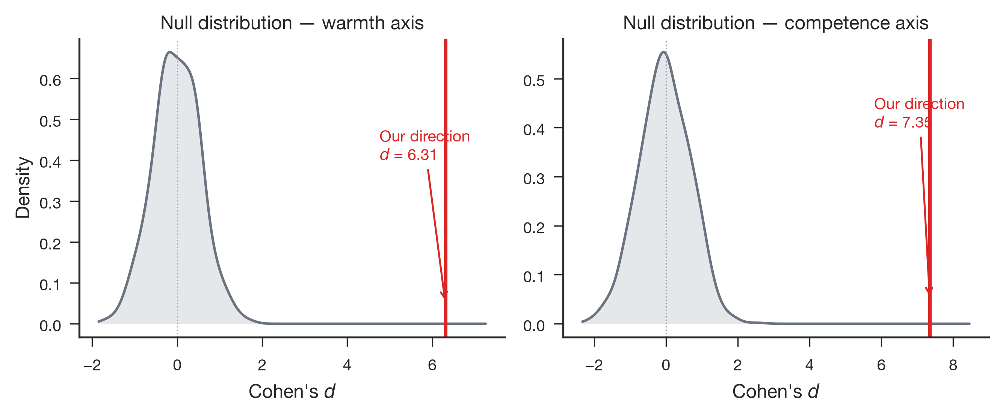

# Qwen3.6-35B-A3B Stage 1: Full-Corpus Extraction

- **Produced:** 2026-07-18 14:14 Europe/Berlin
- **Model:** Qwen/Qwen3.6-35B-A3B, revision `995ad96eacd98c81ed38be0c5b274b04031597b0`
- **Scope:** Stage 1 residual-stream extraction on 200 concept stories
- **Status:** Complete; technical gates passed

## Artifacts

- **Scripts:** `src/qwen36_pipeline.py`, `src/validate_qwen36_stage.py`, `jobs/sge/qwen36_stage.sh`
- **Inputs:** `config/qwen36_35b_a3b.yaml`, `data/stimuli/concept_stories.jsonl`
- **Outputs:** `data/processed/concept_vectors_qwen36_35b_a3b/`, `results/logs/qwen36_35b_a3b_stage1.json`
- **Figures:** `paper/figures/qwen36_35b_a3b/fig1_joint_density.{png,pdf}`, `paper/figures/qwen36_35b_a3b/fig2_random_baseline.{png,pdf}`, `paper/figures/qwen36_35b_a3b/fig3_lorenz_concentration.{png,pdf}`, `paper/figures/qwen36_35b_a3b/fig4_axis_geometry.{png,pdf}`

## Summary

The 35B-A3B mixture-of-experts checkpoint completed the full extraction on one RTX PRO 6000 in bfloat16. Native Hugging Face hooks captured the residual stream at zero-indexed layer 26 of 40 (`probe_layer_frac=0.66`) for 50 stories per condition, without TransformerLens or a vision-tower call.

## Extraction results

| Quantity | Warmth | Competence |
|---|---:|---:|
| Direction norm | 0.480 | 0.644 |
| Random-baseline Cohen's d | 6.309 | 7.350 |
| Random-baseline z score | 11.3 | 10.4 |
| Dimensions carrying 50% squared norm | 106 / 2,048 | 70 / 2,048 |
| Dimensions carrying 80% squared norm | 464 / 2,048 | 392 / 2,048 |

No seeded random direction among 1,000 draws exceeded the extracted target-axis separation. Warmth and competence have cosine 0.619, which exceeds the 0.30 low-overlap target and indicates substantial shared evaluative geometry. Raw direction norms should not be compared directly with the dense 27B checkpoint because the two architectures have very different residual scales.

## Technical validation

- Hooked activations and returned hidden states matched exactly (`max_diff=0.0`).
- The passive hook caused zero logit change.
- The resolved checkpoint revision matched the requested revision.
- Peak reserved memory was 65.543 GiB, 69.0% of the 95.010 GiB RTX PRO 6000.
- The first run took 630.567 seconds inside the pipeline, dominated by the one-time 26-file checkpoint download; the cached Stage 3 run later completed in 49.038 seconds.
- Grid Engine job `1145098` finished with `failed=0`, `exit_status=0`, 676 seconds wallclock, and 66.706 GiB maximum virtual memory.

## Interpretation and boundary

The MoE checkpoint supports the same passive native-HF extraction contract as the dense checkpoint and exhibits strong linearly separable warmth and competence contrasts. Its greater axis overlap motivates explicit cross-axis controls in any later steering experiment. These results concern concept-story representations, not callback behavior.
