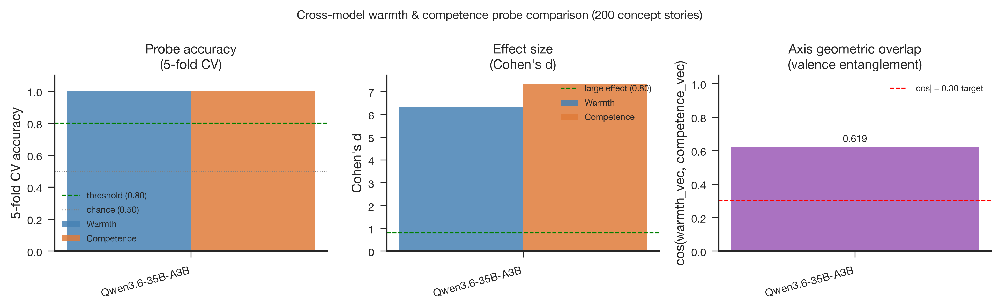

# Qwen3.6-35B-A3B Stage 2: Full-Corpus Probe Validation

- **Produced:** 2026-07-18 14:18 Europe/Berlin
- **Model:** Qwen/Qwen3.6-35B-A3B, revision `995ad96eacd98c81ed38be0c5b274b04031597b0`
- **Scope:** Stage 2 CPU validation of the Stage 1 activation matrices
- **Status:** Complete; technical and statistical gates passed

## Artifacts

- **Scripts:** `src/qwen36_pipeline.py`, `src/validate_probes.py`, `src/validate_qwen36_stage.py`, `jobs/sge/qwen36_stage.sh`
- **Inputs:** `config/qwen36_35b_a3b.yaml`, `data/processed/concept_vectors_qwen36_35b_a3b/`
- **Outputs:** `results/tables/probe_metrics_qwen36_35b_a3b.csv`, `results/logs/validate_probes_qwen36_35b_a3b.json`, `results/logs/qwen36_35b_a3b_stage2.json`
- **Figures:** `paper/figures/qwen36_35b_a3b/fig5_cross_model.{png,pdf}`

## Summary

Warmth and competence reached 1.00 accuracy in every five-fold and topic-held-out split. The MoE checkpoint's effect sizes were large but lower than the dense 27B checkpoint's values on the same stories, while axis overlap was slightly higher.

## Results

| Axis | Cohen's d | 5-fold CV | Topic-holdout CV | High-condition projection | Low-condition projection |
|---|---:|---:|---:|---:|---:|
| Warmth | 6.309 | 1.000 ± 0.000 | 1.000 ± 0.000 | 0.736 ± 0.086 | 0.256 ± 0.065 |
| Competence | 7.350 | 1.000 ± 0.000 | 1.000 ± 0.000 | 1.110 ± 0.092 | 0.466 ± 0.083 |

Perfect topic-held-out performance demonstrates generalization beyond the training topics under this stimulus design. The axis cosine of 0.619 fails the low-overlap criterion, so perfect classification must not be interpreted as construct selectivity.

## Reproducibility and execution

The job used seed `20260527` and exactly matched the Stage 1 stimulus hash. Stage 2 analysis took less than one second inside the pipeline. Grid Engine job `1145116` ran independently on CPU node `scc123` and completed with `failed=0`, `exit_status=0`, 67 seconds wallclock, and 732 MiB maximum virtual memory. The separate Stage 3 audit reproduced both effect sizes and the cosine with zero difference at tolerance `1e-6`.

## Interpretation and boundary

The selected layer provides a robust, topic-general representation for both target contrasts. Its shared geometry remains a construct-validity limitation and should be carried into causal analyses through non-target outcomes and random-direction controls.
