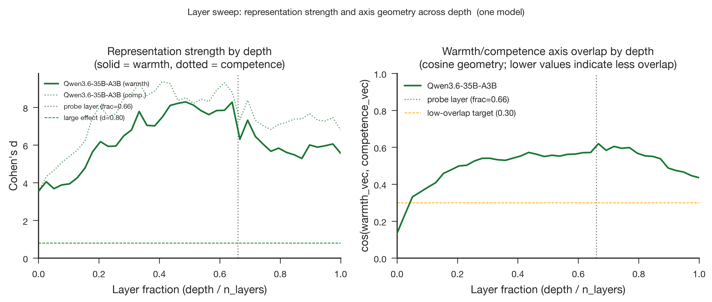

# Qwen3.6-35B-A3B Stage 3: Full-Corpus Layer Sweep

- **Produced:** 2026-07-18 14:18 Europe/Berlin
- **Model:** Qwen/Qwen3.6-35B-A3B, revision `995ad96eacd98c81ed38be0c5b274b04031597b0`
- **Scope:** Stage 3 all-layer residual-stream sweep on 200 concept stories
- **Status:** Complete; all 40 layers finite and cross-stage audit passed

## Artifacts

- **Scripts:** `src/qwen36_pipeline.py`, `src/validate_qwen36_stage.py`, `jobs/sge/qwen36_stage.sh`, `paper/figures/generate_figures.py`
- **Inputs:** `config/qwen36_35b_a3b.yaml`, `data/stimuli/concept_stories.jsonl`, `data/processed/concept_vectors_qwen36_35b_a3b/`
- **Outputs:** `results/tables/layer_sweep_qwen36_35b_a3b.csv`, `results/tables/layer_sweep_qwen36_35b_a3b.meta.json`, `results/logs/qwen36_35b_a3b_stage3.json`
- **Figures:** `paper/figures/qwen36_35b_a3b/fig8_layer_emergence.{png,pdf}`

## Summary

Both target representations were already large in the first measured layer, strengthened toward the middle of the network, and remained large at the output. Warmth peaked at layer 19 and competence at layer 16, both before the fixed layer-26 probe. Axis overlap reached its maximum at the probe layer itself.

## Depth profile

| Quantity | Peak layer | Peak fraction | Peak value | Probe-layer value (L26) | Final-layer value |
|---|---:|---:|---:|---:|---:|
| Warmth Cohen's d | 19 | 0.4872 | 8.293 | 6.309 | 5.565 |
| Competence Cohen's d | 16 | 0.4103 | 9.376 | 7.350 | 6.796 |
| cos(warmth, competence) | 26 | 0.6667 | 0.619 | 0.619 | 0.435 |

Topic-held-out accuracy equaled 1.00 for every layer and axis. Axis cosine crossed 0.30 near the beginning of the network, remained elevated throughout most depths, and declined to 0.435 at the final layer.

## Technical validation

Every one of the 40 layer rows was finite and uniquely indexed. The layer-26 values reproduced Stage 2 warmth d, competence d, and axis cosine exactly within `1e-6`. Native-hook parity, hidden-state parity, passive-logit parity, and the zero-vision-call gate all passed. Peak reserved memory was 65.543 GiB, 69.0% of the RTX PRO 6000. Grid Engine job `1145118` completed independently with `failed=0`, `exit_status=0`, 87 seconds wallclock, and 58.409 GiB maximum virtual memory.

## Interpretation and boundary

The pre-registered two-thirds-depth layer remains defensible because it retains large signal and avoids selecting the observed peak after seeing the data. In this checkpoint it also coincides with maximum warmth-competence overlap, which strengthens the case for cross-axis controls in later steering.
