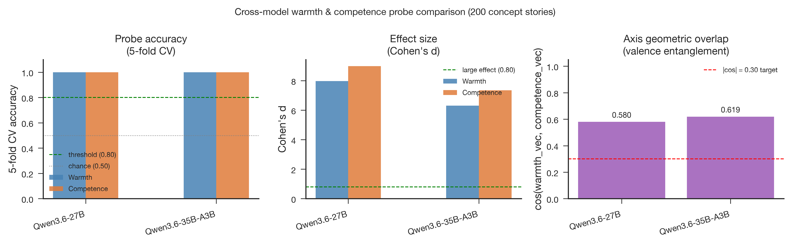
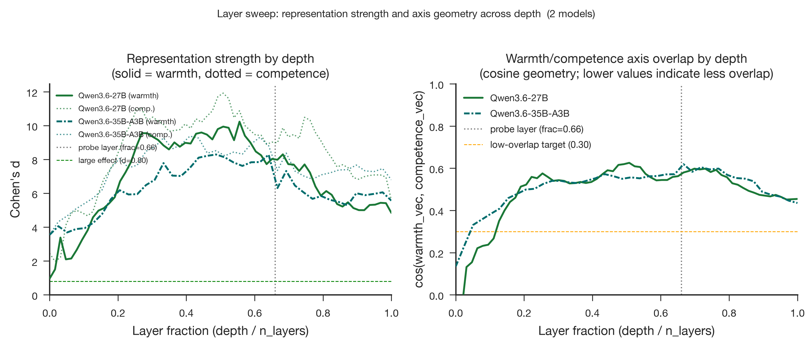

# Qwen3.6 Full Stage Comparison: 27B and 35B-A3B

- **Produced:** 2026-07-18 14:21 Europe/Berlin
- **Models:** Qwen/Qwen3.6-27B and Qwen/Qwen3.6-35B-A3B, pinned revisions
- **Scope:** Cross-model synthesis of full Stage 1, Stage 2, and Stage 3 runs
- **Status:** Complete; all six model-stage runs passed

## Artifacts

- **Scripts:** `src/qwen36_pipeline.py`, `src/validate_qwen36_stage.py`, `src/validate_qwen36_comparison.py`, `paper/figures/generate_figures.py`, `jobs/sge/qwen36_stage.sh`
- **Inputs:** `config/qwen36_27b.yaml`, `config/qwen36_35b_a3b.yaml`, `data/stimuli/concept_stories.jsonl`, `data/processed/concept_vectors_qwen36_27b/`, `data/processed/concept_vectors_qwen36_35b_a3b/`
- **Outputs:** `results/tables/probe_metrics_qwen36_27b.csv`, `results/tables/probe_metrics_qwen36_35b_a3b.csv`, `results/tables/layer_sweep_qwen36_27b.csv`, `results/tables/layer_sweep_qwen36_35b_a3b.csv`, `results/tables/qwen36_cross_model_agreement.csv`, `results/logs/qwen36_27b_stage{1,2,3}.json`, `results/logs/qwen36_35b_a3b_stage{1,2,3}.json`
- **Figures:** `paper/figures/qwen36_cross/fig5_cross_model.{png,pdf}`, `paper/figures/qwen36_cross/fig8_layer_emergence.{png,pdf}`

## Executive summary

Both Qwen3.6 checkpoints passed the full 200-story pipeline without TransformerLens, FP8, multi-GPU sharding, or scheduler dependencies. Each model achieved perfect five-fold and topic-held-out classification for warmth and competence. The dense 27B model had stronger probe-layer effect sizes, while the 35B-A3B MoE model showed slightly greater warmth-competence overlap. Both networks reached maximum target separation before the pre-registered two-thirds-depth probe layer.

## Probe-layer comparison

| Model | Architecture | Probe layer | Warmth d | Competence d | cos(W,C) | Peak reserved VRAM |
|---|---|---:|---:|---:|---:|---:|
| Qwen3.6-27B | Dense, 64 layers, d=5,120 | 42 | 7.983 | 8.986 | 0.580 | 51.348 GiB |
| Qwen3.6-35B-A3B | MoE, 40 layers, d=2,048 | 26 | 6.309 | 7.350 | 0.619 | 65.543 GiB |

The effect-size comparison is scale-standardized and therefore more meaningful than raw direction norms, which differ strongly with residual-stream scale. Both models fail the `|cos| < 0.30` low-overlap criterion.

## Agreement on the same stories

Across all 200 stories, the models' rankings correlate at Spearman ρ=0.930 for warmth and ρ=0.957 for competence. Part of this agreement comes from separating the high and low conditions. Within conditions, agreement remains positive but falls to ρ=0.685 for warmth and ρ=0.630 for competence. The checkpoints therefore share broad ordering while retaining meaningful model-specific differences among stories from the same condition.

## Depth comparison

| Model | Warmth peak (layer, frac, d) | Competence peak (layer, frac, d) | Cosine peak (layer, frac, value) |
|---|---|---|---|
| Qwen3.6-27B | 35, 0.556, 10.232 | 32, 0.508, 11.918 | 32, 0.508, 0.626 |
| Qwen3.6-35B-A3B | 19, 0.487, 8.293 | 16, 0.410, 9.376 | 26, 0.667, 0.619 |

The dense model's target separation peaks later in fractional depth than the MoE model's, though both peaks precede `probe_layer_frac=0.66`. Their cosine profiles converge near 0.60 around the probe depth and fall toward approximately 0.44–0.45 at the final layer.

## Execution outcome

All six stage jobs completed with `failed=0` and `exit_status=0`. Stage 1 and Stage 3 ran on RTX PRO 6000 GPUs; Stage 2 ran independently on CPU. No `hold_jid` dependency linked the jobs. Stage 1 outputs were validated and synchronized before each model's separate Stage 2 and Stage 3 submissions. The cross-stage audits returned zero differences for both effect sizes and axis cosine at tolerance `1e-6`.

## Decision for subsequent work

Both checkpoints are technically suitable for the planned full causal pipeline. The 27B model offers greater memory headroom and stronger probe-layer separation. The 35B-A3B model adds architectural diversity but uses about 14.2 GiB more reserved VRAM and has greater axis overlap. Any steering phase should retain the pinned revisions, native-HF parity gates, explicit-BOS input contract, target and non-target outcomes, and matched random-direction controls.
