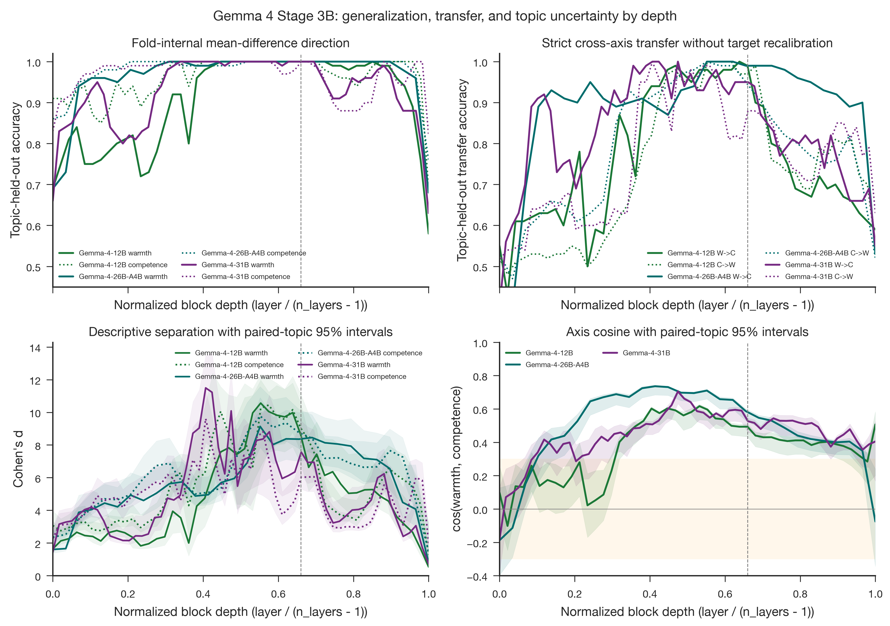

# Gemma 4 Stage 3B: all-layer validation and topic uncertainty

- **Produced:** 2026-07-18 14:53 Europe/Berlin
- **Models:** `google/gemma-4-12B-it`, `google/gemma-4-26B-A4B-it`, `google/gemma-4-31B-it`
- **Scope:** Enhanced Stage 3 audit across every residual-stream layer, with fold-internal direction reconstruction, strict bidirectional cross-axis topic transfer, 1,000-draw paired-topic bootstrap intervals, and SCCKN execution provenance
- **Status:** Complete. All three jobs and the provenance finalizer exited successfully; all legacy Stage 3 columns are reproduced exactly.

## Artifacts

- **Scripts:** `src/layer_sweep.py`, `src/validate_gemma4_stage.py`, `src/validate_probes.py`, `paper/figures/generate_figures.py`, `jobs/sge/gemma4_stage3b.sh`, `jobs/sge/gemma4_stage3b_finalize.sh`, `jobs/sge/submit_gemma4_stage3b.sh`, `jobs/sge/finalize_gemma4_stage3b_provenance.sh`, `jobs/sync_outputs.sh`
- **Inputs:** `data/stimuli/concept_stories.jsonl`, `config/config.yaml`, `results/tables/layer_sweep_gemma4_12b_l40_repro.csv`, `results/tables/layer_sweep_gemma4_26b_a4b.csv`, `results/tables/layer_sweep_gemma4_31b.csv`, `results/tables/probe_metrics_gemma4_{12b,26b_a4b,31b}.csv`, `results/logs/validate_probes_gemma4_{12b,26b_a4b,31b}.json`
- **Outputs:** `results/tables/layer_sweep_stage3b_gemma4_12b_l40.{csv,meta.json}`, `results/tables/layer_sweep_stage3b_gemma4_26b_a4b.{csv,meta.json}`, `results/tables/layer_sweep_stage3b_gemma4_31b.{csv,meta.json}`, `results/logs/validate_layer_sweep_stage3b_gemma4_{12b_l40,26b_a4b,31b}.json`, `results/logs/gemma4_stage3b_submission_20260718T124416Z.json`, `results/logs/gemma4_stage3b_outcome_20260718T124416Z.json`, `results/logs/gemma4_stage3b_20260718T124416Z_{12b,26b,31b,final}.{out,err}`
- **Figures:** `paper/figures/gemma4_cross/fig8_layer_emergence.{png,pdf}`, `paper/figures/gemma4_cross/fig8b_stage3b_validation.{png,pdf}`

## Executive summary

Stage 3B confirms that the original depth curves were numerically sound and adds the validation that the legacy sweep lacked. Every legacy value, including full-feature topic accuracy, Cohen's d, cosine, and residual norm, matches the canonical Stage 3 table at every layer for all three models. No probe-layer or model configuration was changed.

The warmth and competence directions generalize extremely well across held-out topics through broad middle-layer regions. At the configured 0.66-depth layer, fold-internal direction accuracy is 1.00 for both axes in every model. The main scientific limitation also survives the stricter test: a direction learned only from warmth stories predicts competence stories, and vice versa, with 0.88 to 0.99 accuracy at that layer. The representations are therefore powerful but not construct-pure.

Paired-topic bootstrap results support the existence of middle-layer amplification, but they weaken any claim that one exact layer is uniquely optimal. Peak uncertainty is narrow for 26B-A4B, wider for several 12B and 31B quantities, and especially wide for the 31B competence peak. The fixed 0.66-depth layer remains a preregistered, comparable analysis choice rather than a data-selected optimum.

## 1. What Stage 3B tests

The legacy Stage 3 classifier could use any activation dimension and was retrained inside each topic fold. Stage 3B adds two harder tests at every layer:

1. **Direction-specific topic generalization.** Each training fold constructs only the mean(high) minus mean(low) vector. Held-out topics are classified by projection onto that training-only direction.
2. **Strict cross-axis transfer.** A direction and threshold learned from one axis are applied unchanged to held-out stories from the other axis. No target-axis threshold or sign is recalibrated.

The 1,000 bootstrap draws resample the 50 paired topics rather than individual stories. This preserves the four condition cells belonging to a topic and treats topic choice as the uncertainty source. Intervals describe sensitivity to this story-topic sample; they are not population confidence intervals for people, hiring decisions, or natural language generally.

## 2. Configured-layer results

| Model | Layer / exact frac | Direction topic CV W / C | Strict W-to-C / C-to-W | Warmth d, 95% interval | Competence d, 95% interval | cos(W,C), 95% interval |
|---|---:|---:|---:|---:|---:|---:|
| Gemma 4 12B | 31 / 0.6596 | 1.00 / 1.00 | 0.99 / 0.97 | 8.63 [6.88, 10.56] | 9.04 [7.59, 11.15] | 0.494 [0.433, 0.510] |
| Gemma 4 26B-A4B | 19 / 0.6552 | 1.00 / 1.00 | 0.99 / 0.95 | 8.36 [7.00, 9.99] | 8.75 [7.77, 10.18] | 0.587 [0.530, 0.601] |
| Gemma 4 31B | 39 / 0.6610 | 1.00 / 1.00 | 0.95 / 0.88 | 7.56 [6.16, 9.47] | 6.03 [5.29, 7.41] | 0.526 [0.459, 0.545] |

These direction-specific scores exactly reproduce the corrected Stage 2 results. Perfect target-axis accuracy means the intended contrast survives topic holdout. High strict transfer means much of that contrast is also useful for the other construct, which is consistent with a shared positive-versus-negative person-evaluation component. It does not show that warmth and competence are interchangeable, but it prevents treating either vector as an isolated measurement of only its named construct.

## 3. Depth-wide findings

Direction-specific topic accuracy remains high across most of the networks, although it declines at the earliest and final layers. Across all layers, warmth/competence accuracy ranges are 0.58–1.00/0.69–1.00 for 12B, 0.68–1.00/0.76–1.00 for 26B-A4B, and 0.63–1.00/0.82–1.00 for 31B. This supports a broad middle-depth representation rather than a signal confined to the chosen probe layer.

Strict transfer is less uniform. Its all-layer W-to-C/C-to-W ranges are 0.43–1.00/0.48–1.00 for 12B, 0.35–1.00/0.47–1.00 for 26B-A4B, and 0.40–1.00/0.51–1.00 for 31B. Shared evaluative structure is consequently depth-dependent. The 0.66 layer lies in a high-transfer region for all three models, not in a region where warmth and competence are especially separated.

Figure 8B separates four questions that the legacy figure combined or omitted. The upper-left panel asks whether each mean-difference direction generalizes to new topics. The upper-right asks whether the same learned scale transfers to the other construct. The lower panels retain descriptive separation and cosine, now with paired-topic uncertainty bands. The dashed line marks the fixed 0.66-depth choice, not an estimated optimum.

## 4. Peak uncertainty

| Model | Warmth-d peak layer, bootstrap 95% range | Competence-d peak layer, bootstrap 95% range | Cosine peak layer, bootstrap 95% range |
|---|---:|---:|---:|
| Gemma 4 12B | 26 [24, 30] | median 27 [20, 30], mode 30 | 25 [19, 26] |
| Gemma 4 26B-A4B | 16 [16, 20] | 16 [15, 18] | 12 [12, 13] |
| Gemma 4 31B | 24 [23, 28] | 24 [23, 34] | 28 [28, 28] |

The 26B-A4B peaks are the most stable overall: bootstrap samples choose layer 16 in 88.2% of warmth draws and 81.7% of competence draws. For 12B competence, the point-estimate maximum is layer 27, but the modal bootstrap maximum is layer 30 and the interval spans layers 20–30. The 31B competence interval extends from layer 23 to 34. These results support a middle-layer region while cautioning against a single best-layer story. The 31B cosine maximum is unusually stable at layer 28 in all 1,000 draws, but this stability concerns shared geometry, not construct specificity.

## 5. Model scale and the MoE variant

The three curves are useful as within-family descriptions, but they are not a clean parameter-scaling experiment. Gemma 4 26B-A4B is a mixture-of-experts model with about four billion active parameters per token, while 12B and 31B are dense models. Its narrower peak intervals and stronger probe-layer cosine cannot be interpreted as evidence that an intermediate dense model has more compact or more entangled representations.

Raw vector magnitudes also cannot be compared directly across different residual widths and activation scales. Residual-normalized or dimension-normalized quantities can provide descriptive context, as in the Stage 1 report, but no normalization makes coordinate concentration or effect size fully model-invariant. Stage 3B therefore compares layer profiles, held-out accuracy, transfer, and within-model uncertainty without claiming a monotonic size law.

## 6. Reproducibility and execution

| Job | Model/task | Required GPU | Host | Wall time | Max memory | Result |
|---:|---|---|---|---:|---:|---|
| 1145163 | Gemma 4 12B | NVIDIA L40 | scc192 | 97 s | 17.380 GB | `failed=0`, `exit_status=0` |
| 1145164 | Gemma 4 26B-A4B | RTX PRO 6000 Blackwell | scc214 | 61 s | 39.517 GB | `failed=0`, `exit_status=0` |
| 1145165 | Gemma 4 31B | RTX PRO 6000 Blackwell | scc214 | 78 s | 57.779 GB | `failed=0`, `exit_status=0` |
| 1145166 | Provenance finalizer | CPU | scc123 | 53 s | 64.984 MB | `failed=0`, `exit_status=0` |

All runs used seed 20260527, 200 stories, raw-passage input, bfloat16, TransformerLens 3.5.1 through the transformer bridge, and a single visible accelerator. The metadata records the exact device, source commit `ddb61abe8807ab7af85d5af24766089e8fa04ac0`, and stimulus SHA-256 `81c3b973e00f131e051a8250d6d076ef7a536974fd8a5fc5596af4b36b6ae916`. The outcome manifest stores SHA-256 hashes for all tables, validators, and raw scheduler logs.

## 7. Scientific conclusion and limits

The strongest supported conclusion is that all three Gemma 4 variants contain robust, topic-general warmth- and competence-related linear signal across broad portions of their depth. At the configured layer, the effect is large and stable to paired-topic resampling. The same evidence also shows that the axes retain a strong shared evaluative component, so high accuracy should not be described as clean construct separation.

This experiment remains internal validation on one synthetic story-generation distribution. Topic holdout prevents identical topics from entering training and test folds, but it does not provide human construct validity, natural-text generalization, or causal evidence about hiring decisions. Human ratings, names, callback decisions, and cross-axis steering controls remain necessary before making claims about social judgments or external validity.
